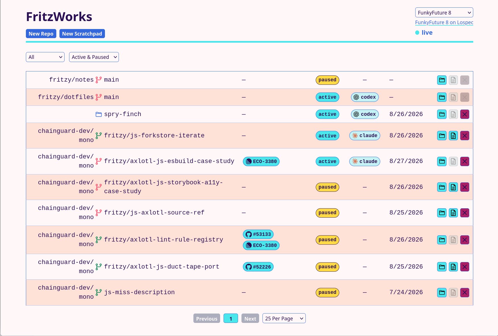

# @fritzy/ai-workstream

`ai-workstream` is an opinionated `ws` command for managing development work as Git worktrees and Zellij tabs. Each workstream records a repository, branch, status, linked issues, short logs, and longer notes. Tabs can combine configurable shell, editor, and AI-agent panels, using either Claude Code or Codex.

The package also installs `ws-mcp`, an stdio MCP server exposing the non-interactive workstream operations.



## Requirements

- macOS or Linux
- Node.js 22.13.0 or newer
- Git and Zellij
- Claude Code, Codex, or both
- An editor and shell for those panels, if enabled (defaults: `nvim` and `zsh`)
- GitHub CLI (`gh`) for PR discovery and fork routing
- The `github/gh-stack` extension for `ws stack link`

Repository clones default to SSH URLs. Set `gitProtocol` to `https` if that better matches your GitHub authentication.

## Install

```sh
npm install --global @fritzy/ai-workstream
ws --version
```

The package name is scoped, but its primary executable remains `ws`.

## Configuration

The package ships a complete [`config.ini`](./config.ini). A user file at `$XDG_CONFIG_HOME/ai-workstream/config.ini`, normally `~/.config/ai-workstream/config.ini`, is layered over those defaults. The user file can contain only the settings you want to change. Run `ws config` to print both file paths and the fully resolved configuration.

```ini
panels = shell, editor, agent
agent = claude
zellijSession = ws
gitProtocol = ssh

[paths]
repositories = ~/github
scratchpads = ~/scratchpad
data = ${XDG_DATA_HOME}/ws

[locations.notes]
repo = fritzy/notes
path = /home/nathan.fritz/notes/
weeklyNotes = true

[locations.dotfiles]
repo = fritzy/dotfiles
path = /home/nathan.fritz/dotfiles/

[commands]
shell = zsh
editor = nvim
claude = claude
codex = codex

[models.claude]
default = opus
scratch = sonnet

[models.codex]
default =
scratch =

[server]
host = 127.0.0.1
port = 7337
pollInterval = 1000
```

Paths beginning with `~/` are expanded against the user's home directory. `${HOME}` and `${XDG_DATA_HOME}` are also supported at the start of a path. Relative user paths are resolved from the user configuration file's directory. Every `[locations.<name>]` section becomes a configured location in API list/detail responses, assumes the `main` branch unless a `branch` setting is present, and is always non-closeable (pause only). `weeklyNotes = true` asks the editor panel to open that location's current weekly notes file. The legacy `[paths]` `notes` and `dotfiles` settings remain supported as path overrides. Commands may be a single executable string or a JSON-style array containing the executable and fixed arguments, such as `editor = ["nvim", "--clean"]`. Empty model values disable an explicit model selection.

The default data path intentionally remains `~/.local/share/ws` so existing databases continue to work after upgrading.

### Environment overrides

Every setting can also be overridden without editing the INI file:

| Setting | Environment variable |
| --- | --- |
| Config file | `AI_WORKSTREAM_CONFIG` |
| Repository root | `AI_WORKSTREAM_REPOSITORIES` |
| Scratchpad root | `AI_WORKSTREAM_SCRATCHPADS` |
| Notes root | `AI_WORKSTREAM_NOTES` |
| Dotfiles path | `AI_WORKSTREAM_DOTFILES` |
| Data directory | `AI_WORKSTREAM_DATA` |
| Panel roles | `AI_WORKSTREAM_PANELS` |
| Default agent | `AI_WORKSTREAM_AGENT` |
| Shell/editor commands | `AI_WORKSTREAM_SHELL`, `AI_WORKSTREAM_EDITOR` |
| Agent commands | `AI_WORKSTREAM_CLAUDE`, `AI_WORKSTREAM_CODEX` |
| Agent models | `AI_WORKSTREAM_CLAUDE_MODEL`, `AI_WORKSTREAM_CODEX_MODEL` |
| Scratchpad models | `AI_WORKSTREAM_CLAUDE_SCRATCH_MODEL`, `AI_WORKSTREAM_CODEX_SCRATCH_MODEL` |
| Zellij session | `AI_WORKSTREAM_ZELLIJ_SESSION` |
| GitHub URL protocol | `AI_WORKSTREAM_GIT_PROTOCOL` |
| API bind address/port | `AI_WORKSTREAM_HOST`, `AI_WORKSTREAM_PORT` |
| API state polling interval | `AI_WORKSTREAM_POLL_INTERVAL` |

Command arrays in environment variables can be JSON, for example `AI_WORKSTREAM_EDITOR='["nvim","--clean"]'`. Existing `WS_*` forms are accepted as compatibility aliases.

Precedence is: one-run CLI flags, environment variables, the user INI file, then the bundled `config.ini`.

## Panels and agents

The standard panel roles are `shell`, `editor`, and `agent`. Configure any non-empty subset globally, or override it for a single newly opened tab:

```sh
ws new fritzy/example feature-x --panels shell,agent
ws resume feature-x --no-editor
```

Choose an agent in configuration or per command:

```sh
ws new fritzy/example feature-x --agent codex
ws scratch investigation --claude
ws resume feature-x --codex --model gpt-5.6-sol
```

For an existing workstream directory, Claude uses `--continue`; Codex uses the officially documented cwd-scoped [`codex resume --last`](https://developers.openai.com/codex/cli/reference). Both fall back to a new session when no matching session exists. A `--seed file.md` starts a fresh session with instructions to read that document.

Panel-management commands are `ws open-shell`, `ws open-editor`, `ws open-agent`, and their `close-*` counterparts. `open-claude` and `open-codex` force a provider. The older `zsh`, `nvim`, and `claude` command aliases remain available.

Install the user-level Claude Code, Codex, and Zsh lifecycle hooks once to track when an agent or shell is working or waiting for input:

```sh
ws hooks install
ws hooks status
```

The installer preserves existing hooks and is idempotent. It adds `UserPromptSubmit`, `Stop`, `PermissionRequest`, `PostToolUse`, and `SessionStart` handlers to both clients, plus Claude's idle/permission notification handler. It also installs a Zsh integration under `~/.config/ai-workstream/shell.zsh` and sources it from `.zshrc`; `preexec` reports a running command and `precmd` reports a ready prompt. Agent and shell panes opened by `ws` carry their workstream ID, with working-directory matching as a fallback.

## Main commands

Run `ws help` for the complete command reference. Common workflows include:

```sh
ws list
ws refresh
ws new org/repo feature-branch
ws join feature-branch
ws pause feature-branch
ws close feature-branch
ws scratch experiment
ws issue add https://github.com/org/repo/issues/123 --ws feature-branch
ws log "identified the root cause" --ws feature-branch
ws stack --ws feature-branch
```

`ws refresh` scans tabs across every running Zellij session. An open tab makes its workstream `active`; an `active` workstream with no tab becomes `paused`; and a `closed` workstream with no tab remains closed. It makes no database changes if Zellij cannot be queried reliably.

Worktrees are stored under `<repositories>/<org>/<repo>/<branch>` with a bare clone at `<repositories>/<org>/<repo>/.bare`. Scratchpads are plain directories without Git backing. The SQLite database and agent seed documents live under the configured data directory.

`ws close` refuses to remove a dirty Git worktree unless explicitly forced. Scratchpad directories are retained unless deletion is explicitly requested. `ws stack rebase` rewrites history, and `ws stack link` pushes branches and may create pull requests; review their output and confirmations carefully.

## REST API and web client

Start the local service in the background with:

```sh
ws daemon                 # same as: ws daemon start
ws daemon status
ws daemon stop
ws web start              # ensure it is running and open the web client
```

`restart`, `foreground`, and `log` are also available. `--host` and `--port` override the configured address for `start`, `restart`, `foreground`, or `web start`. The default is `http://127.0.0.1:7337`; opening that URL serves the packaged `index.html` and `webclient.js`. Click a workstream row to open its detail modal with repository and issue links, path and directory availability, source, stack relationships, timestamps, and workstream actions. The open modal is stored as `session=<id>` in the URL, so it participates in Back/Forward history and survives reloads and bookmarks. A scratchpad's Name field changes its display name and open tab title without renaming its original directory or branch identifier. The detail and creation modals share Custom, Linear, and GitHub link controls with autocomplete and a combined pill list; detail changes are saved immediately when a link is added or removed. A `#2353` entry expands against a repository workstream, `owner/repo#23945` expands anywhere (and is required for GitHub shorthand in a scratchpad), and a Linear key such as `ECO-23550` is resolved with `linear issue url` before its full URL is saved. The animated panel-layout toggle chooses whether newly created and resumed sessions open with shell/editor/agent or with shell/agent, and remembers that choice in local storage. The theme selector includes [curiosities](https://lospec.com/palette-list/curiosities) (the default palette), [Clément 8](https://lospec.com/palette-list/clement-8), [Oil 6](https://lospec.com/palette-list/oil-6), [SLSO8](https://lospec.com/palette-list/slso8), [Endesga 8](https://lospec.com/palette-list/endesga-8), and [FunkyFuture 8](https://lospec.com/palette-list/funkyfuture-8) from Lospec, plus [Dracula](https://github.com/dracula/dracula-theme) and [Nord](https://www.nordtheme.com/docs/colors-and-palettes/), and remembers the selection in local storage. `ws web start` reuses a healthy daemon whose server-source revision is current, automatically replaces an outdated daemon after a package update or local server edit, and then invokes `xdg-open` on Linux or `open` on macOS with its actual URL.

The collection/detail endpoint is:

```text
GET /ws/{id}/?type={repo,scratchpad,misc}&page=0&perpage=25&status={active,paused,closed,all,active_paused}
```

Use `all` as the ID for a collection, or a numeric/configured-location ID for one item. `type` is optional; `status` defaults to `active_paused`, and `perpage` defaults to 25 and is capped at 100. The web client keeps type, status, page, and per-page settings in the URL without reloading the page, and shows numbered pagination below the list. The `misc` type contains every configured `[locations.<name>]` entry.

The New Repo button opens a creation modal with repository and branch/ref inputs, associated links, source and path previews, agent selection, and the initial panel layout. Its links section has a free-form field, a Linear autocomplete, and a GitHub autocomplete covering JavaScript customer escalations plus review-required PRs in `chainguard-dev/mono` and `chainguard-dev/ecosystems-rebuilder.js`. Press Enter or use the Add button to stage a link; each field accepts multiple links, shown together beneath the inputs as removable list-view pills with provider icons. Custom HTTP links use the site's favicon and hostname, with the complete URL in the hover tooltip. Opening the empty Linear control shows incomplete work assigned to the viewer or unassigned in the current ECO cycle; typing runs a debounced full-text search across active ECO issues, including issues outside the current cycle. The same three link inputs appear when creating a scratchpad. When a newly created repo or scratchpad has associated links, its agent starts fresh with a seed briefing that lists the canonical links and directs it to retrieve authenticated details with the Linear skill/CLI or `gh`; this also applies to CLI and MCP creation, and is appended to an explicit seed when one is supplied. It submits the following collection request, creates or restores the worktree, opens its Zellij tab, and then shows the new session details:

```text
POST /ws
{"repository":"org/repo","selector":"feature-branch","agent":"claude","panels":["shell","editor","agent"],"links":["#123"]}
```

`GET /ws/new` returns the configured repository and scratchpad roots, repositories used in the last three months, default agent, and default panels used to initialize the creation modals. `GET /ws/link-suggestions/linear` queries `linear api`; `GET /ws/link-suggestions/github` queries `gh` and groups the configured work sources. Both accept an optional `q` filter and cache their CLI results briefly.

The New Scratchpad button opens a parallel modal with an optional name, scratch path preview, agent, links, and initial panels. Leaving the name empty generates a readable random name. GitHub shorthand must include its repository because scratchpads have no associated repository of their own.

```text
POST /ws/scratchpad
{"name":"investigation","agent":"codex","panels":["shell","agent"],"links":["org/repo#123"]}
```

Commands accept a JSON object:

```text
POST /ws/{id}/{cmd}
```

| Command | JSON body |
| --- | --- |
| `pause`, `resume` | `{}` |
| `close` | `{}` closes state only; `{"remove":true}` also removes the directory; dirty Git worktrees require `"force":true` |
| `rename` | `{"name":"New label"}` |
| `log` | `{"body":"What changed","done":true}` |
| `issue-add` | `{"refs":["ABC-123"]}` or `{"ref":"ABC-123"}` |
| `issue-remove` | `{"ref":"ABC-123"}` |
| `panel-toggle` | `{"panel":"shell"}`, `{"panel":"editor"}`, or `{"panel":"agent"}` |
| `agent-set` | `{"agent":"claude"}` or `{"agent":"codex"}` persists the provider and replaces an open agent panel |
| `focus-agent` | `{}` focuses the workstream's Zellij tab and Claude/Codex pane |
| `focus-shell` | `{}` focuses the workstream's Zellij tab and shell pane |
| `open-path` | `{}` launches the workstream directory with `xdg-open` |
| `open-notes` | `{}` launches the newest existing notes directory for the workstream with `xdg-open` |

The `resume` command reconstitutes a missing worktree, creates or focuses its tab in the configured Zellij session, and marks the workstream active. The daemon performs Zellij operations without attaching itself to an interactive terminal. Workstream detail responses include live `panels` state, which powers the Shell, Editor, and Agent toggles in the modal. The modal's provider selector persists Claude or Codex per session. If its Agent panel is open, changing providers stops that pane and starts the selected provider with Claude `--continue` or Codex `resume --last`; otherwise the choice applies when the panel is next opened. Every configured location supports pause/resume, panel toggles, provider selection, focus, and path opening, but the API always rejects `close` for it.

In the web list, the Actions cell includes icon-only Shell and Agent controls; either icon becomes a spinner while its process is working. Click one to focus that workstream's Zellij tab and corresponding pane. On Kitty, `ws` also focuses the exact terminal window when Kitty exposes a remote-control socket (`allow_remote_control yes` or `socket-only`, plus `listen_on` in `kitty.conf`). Zellij focus still succeeds when terminal-window activation is unavailable.

Web clients connect to `ws://127.0.0.1:7337/ws/events`. Adding a workstream emits `{"id":123,"type":"new_session"}`; changing its session status or associated links emits `{"id":123,"type":"update_session"}`; and activity hooks emit `{"id":123,"type":"agent_status","status":"working"}` or `{"id":123,"type":"shell_status","status":"ready"}`. Session messages are invalidations, so clients GET the affected workstream and their current collection again. Mutations are recorded in a durable event journal; the service detects changes made through the CLI or MCP by polling that journal every `server.pollInterval` milliseconds, while REST changes emit immediately.

Git cleanliness is cached in SQLite. List and detail GETs return the cached value immediately, then queue an asynchronous `git status` for each loaded repository or configured location. A changed result records an `update_session` event and is pushed over the WebSocket, causing clients to reload the new cached state without making the original GET wait on Git.

The API has no authentication and therefore binds to loopback by default. Do not expose it on a public interface without putting an authenticated proxy in front of it.

## MCP server

After a global install, register the stdio server with either client:

```sh
claude mcp add --scope user ws -- ws-mcp
codex mcp add ws -- ws-mcp
```

The MCP tools share the same configuration and database as the CLI. `ws_config` reports the resolved settings.

## Development and publishing

```sh
npm install
npm test
npm run check
npm pack --dry-run
```

`prepack` and `prepublishOnly` both run the complete check suite. Scoped public publication uses:

```sh
npm publish --access public
```
