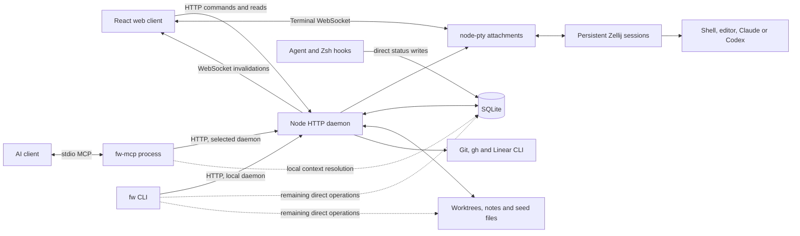

# FritzWorks: standalone repository

**Current direction (September 24, 2026):** distribute a source checkout.
Users clone, run `npm i`, then `npm run setup`; `npm start` opens the UI.
Tarball creation and npm publication are out of scope. The original distribution
assessment below is retained as historical research. The September 22 update
records completed installation work; the [September 24 plan](#standalone-plan--september-24-2026)
is the authoritative remaining plan for configuration, storage, remotes, and
daemon ownership. Historical recommendations that conflict with it are superseded.


Assessment of the working tree on September 17, 2026, including the existing
uncommitted PTY change. This is an analysis, not a repository extraction or a
publication. The main source is [packages/fritzworks](../packages/fritzworks/).

**Recommendation.** Extract FritzWorks into one repository and initially publish
one npm package containing the daemon, CLI, stdio MCP adapter, compiled web
client, hooks, and optional desktop integration. Its runtime is already mostly
contained within the package directory. The larger task is removing personal
assumptions and making installation, configuration, and upgrades dependable.

It is already structurally an npm package: `@fritzy/fritzworks@1.0.0`, with three
executables, a runtime file allowlist, a license, and build/release scripts. A
fresh tarball install exposed a native-dependency installation problem, so the
existing README's single install command is not yet sufficient in every tested
environment. This assessment does not establish whether the package is currently
published or whether its npm scope is available to a particular publisher.

**Current architecture.**



The HTTP daemon and MCP server are separate processes. `fw-mcp` is a stdio
client of the HTTP daemon; the daemon does not currently expose an HTTP MCP
endpoint. AI clients start the stdio process. Local service requests start the
HTTP daemon on demand; requests for a configured remote daemon do not start it.

| Component | Current responsibility | Extraction implications |
| --- | --- | --- |
| `server.js`, `lib/daemon.js` | HTTP startup, PID metadata, health checks, logging, source-revision detection and detached-process lifecycle | Already package-relative; needs stronger configuration and upgrade handling |
| `lib/api.js` | HTTP routes, WebSocket events, terminal ownership, watchers, operations and static assets | Main orchestration boundary; about 2,480 lines and several responsibilities |
| `lib/core.js`, `lib/panels.js`, migrations | SQLite state, worktrees, lifecycle, resources, layouts and event journal | Mostly reusable; direct consumers prevent the daemon from being the sole state owner |
| `mcp.js` | Tool schemas and HTTP delegation, including named remote daemons | Already suitable for the `fw-mcp` executable; local context resolution still opens SQLite |
| `cli.js` | Interactive selection, creation, lifecycle, hooks, daemon control and reporting | Still local-only; several operations bypass HTTP |
| `web-v2/`, `web/v2/` | React/Vite/Tailwind source and built assets, with xterm terminals | Can ship in the same npm tarball; users need no separate frontend build |
| `lib/hooks.js`, `shell/fritzworks.zsh` | Install client hooks and report working/ready state | Install/status exist; configurable targets and uninstall are missing |
| `app.js`, `desktop/` | Dedicated Firefox window, profile modifications and Linux launcher files | Optional integration with personal-environment assumptions |

**Daemon and HTTP API.**

The daemon owns substantial shared state already: workstreams, associated links,
ordered panel groups, open resources, persistent terminal identities, and active
workspace state. The API covers lifecycle operations, panel/resource changes,
notes and Markdown editing, PR previews, terminal resets, configuration, daemon
discovery and browser refresh. It serves the built application at `/v2/`.

Browser events are primarily invalidations: a mutation changes SQLite, the
daemon broadcasts an event, and the browser reloads the relevant authoritative
model. A durable database event journal also catches changes from other
processes, including hooks. Markdown watchers follow focused files, and saves
use content hashes to detect conflicting edits. Panel mutations use optimistic
revision checks. These are useful foundations to preserve.

Terminals are not just child shells of the browser. Zellij retains the underlying
session while node-pty provides an attachment to a WebSocket client. Ownership,
suspension and reconnection prevent multiple browser views from simultaneously
controlling the same attachment. This distinction should remain explicit in
documentation and tests, especially across daemon upgrades.

The remaining daemon work is concrete:

- **Finish state ownership.** The CLI still directly resolves local targets,
  modifies stack relationships, executes stack/rebase operations, and reads or
  writes notes/digests. MCP still opens the local database for context. Hooks
  also open and initialize the database for status updates. Introduce daemon
  operations for these cases, or explicitly retain and document a narrow offline
  hook mechanism rather than claiming all state goes through HTTP.
- **Separate configuration from module initialization.** `CONFIG` is resolved
  once at import time. Core database/path defaults and even the static asset CSP
  derive from that singleton. Passing a different `config` to the service does
  not consistently redirect all helpers. Prefer one explicit application context
  containing configuration, database, providers and process runners.
- **Make configuration changes observable.** Daemon freshness hashes package
  sources, not the resolved user configuration. Editing a config file does not
  automatically replace the running daemon. Offer an explicit reload/restart
  contract and display the effective config revision.
- **Define supervised operation.** Detached auto-start is already implemented;
  systemd is not required for normal use. For optional systemd/launchd support,
  make foreground mode discoverable by the CLI and prevent auto-start from
  competing with a supervised instance. Foreground startup currently does not
  write the daemon PID metadata unless `FRITZWORKS_DAEMON=1` is supplied.
- **Harden long-running operation.** Add request cancellation/timeouts to the
  daemon client, log rotation and useful diagnostics. Several Git/Zellij paths
  still use synchronous child processes, which can stall HTTP and terminal
  processing. Move expensive operations behind asynchronous jobs where needed.

**MCP and CLI parity.**

The MCP adapter has a better remote boundary than the CLI: it advertises named
daemons, accepts a daemon selector, and performs remote Git/filesystem work
through that daemon's API. It appropriately requires explicit workstream
selection for remote operations rather than interpreting the local working
directory as remote context.

The CLI imports `requestLocalService`; it has no equivalent general daemon
selector. Both `fw list` and MCP `fw_list` request one page of 100 workstreams,
whereas the web client iterates pages. A generic release should avoid silently
truncating the command/tool view of larger inventories.

Create a maintained action matrix for web, CLI and MCP. It should cover lifecycle,
resources, panel/group management, provider selection, resets, stack operations,
notes and browser focus. Some view-local actions can intentionally remain web
only. Shared operations should have consistent target resolution and errors.
An API version/capability response would let clients handle older remote daemons
without requiring every machine to update simultaneously.

**Web client.**

The frontend is already a distributable local application. Vite builds source
from `web-v2/` into `web/v2/`; React, xterm and Markdown rendering dependencies
are build dependencies rather than packages users must install separately.
The daemon serves the resulting assets. A separate web package or hosted service
is not needed for extraction.

State is deliberately split: layout/resources live in SQLite, while theme,
terminal font, sidebar width and branch-prefix presentation live in browser
storage. This is reasonable, but config documentation should distinguish daemon
settings from browser preferences. A future settings UI can provide editable
daemon configuration with validation and an explicit restart notice.

Specific frontend gaps:

- The default hidden branch prefix is `fritzy/`; the Linear input says “current
  ECO cycle.” Replace personal defaults and derive integration labels from the
  daemon's configured capabilities.
- Missing `linear`/`gh` authentication should disable or explain the affected
  controls without making basic session creation look broken.
- The Vite development proxy covers `/fw`, `/notes`, `/markdown` and `/icons`,
  but omits routes now used by the app, including `/daemons`, `/panel-layout` and
  `/browser`. Update it or use one development proxy rule with a clear asset
  boundary.
- Paths assume deployment at the origin root plus `/v2/`. WebSocket URL creation
  discards a configured daemon URL's pathname. Either document root-only
  deployment or support a configurable API/application base path consistently.
- Ordinary browser use is supported by `fw web start`; make that the default
  onboarding path. The dedicated Firefox launcher should be optional.

**Configuration: what works and what is missing.**

The current resolver already provides bundled INI defaults, an XDG user file,
environment overrides, legacy-path fallback, home expansion, command arrays,
provider-specific models and named remote daemons. It validates several useful
types and prints resolved settings with `fw config`. This needs extension, not
replacement with a new configuration framework.

| Area | Current limitation | Change needed for another user |
| --- | --- | --- |
| Built-in locations | Defaults name `fritzy/notes` and `fritzy/dotfiles` | Ship no personal repositories; offer an optional example configuration |
| Remote machines | Every installation inherits `workstation` at `http://127.1.1.2:7337` | Default to local only; make remote endpoints explicitly opt-in |
| Removing defaults | Deep merge has no documented per-location/per-daemon disable or deletion convention | Add `enabled=false` or explicit replacement/removal semantics; validate it |
| Notes | `paths.notes` is derived while resolving configured locations; notes layout assumes work/journal, Monday weeks and English headings | Make notes storage independent of a Git-backed location; allow basic notes without a notes repository; later add templates/locale/week settings |
| Work suggestions | `lib/suggestions.js` fixes an ECO team, Chainguard repositories, a label and three teammate accounts | Configure named work sources, filters, ranking and limits; disabled sources make no requests |
| Git hosting | Clone URLs, PR parsing and links assume github.com | Clearly support GitHub first; add host/clone URL configuration before claiming enterprise or generic Git support |
| External commands | Only shell/editor/Claude/Codex commands are configurable; Git, gh, Linear, Zellij and some openers are literal executables | Extend the command map and expose capability checks |
| Agent support | Provider names and invocation/resume behavior are fixed to Claude/Codex, including database constraints | Support those two well initially; use adapters if adding more providers later |
| Shells | Shell executable can be fish/Bash/etc., but installed status hooks are Zsh only | Match hook installation to selected shell or explicitly disable unsupported status tracking |
| Client directories | Hooks target `~/.claude/settings.json` and `~/.codex/hooks.json` | Resolve supported client-home overrides and allow explicit target paths |
| Desktop | Firefox `appmode` must already exist; profile discovery is Linux-oriented; API path opening always uses `xdg-open` | Default-browser launch plus platform-aware file opening; optional profile creation and desktop install |
| Presentation | Some preferences exist only in localStorage, including personal branch-prefix defaults | Neutral defaults and documented ownership/import/export of preferences |
| Validation and reload | Unknown keys can be ignored; configuration is an import-time snapshot | Schema/version, unknown-key diagnostics, `config validate`, effective-source reporting and explicit reload behavior |

“Fully configurable” should have a defined product boundary. A useful first
release can support a single developer on Linux/macOS, GitHub repositories,
Zellij, and Claude/Codex. Windows, arbitrary Git forges, interchangeable terminal
backends and third-party agent plugins are separate expansions. They need not
block a good standalone package within the declared boundary.

**Hooks and agent integration.**

`fw hooks install` already merges agent hooks and installs a copied Zsh script.
It recognizes legacy `ws` hooks, writes settings atomically, avoids duplicate
handlers, and preserves a symlinked `.zshrc` by updating its resolved file.
`fw hooks status` reports installation. Events map to working/ready state;
`FRITZWORKS_ID` or working-directory context associates them with a session.

For distribution, add provider/shell selection, explicit config paths,
installation previews/backups, and uninstall that removes only FritzWorks-owned
entries. Respect client-specific hook trust/enablement rather than equating
“file contains a hook” with “client executes the hook.” Hook commands also need
to resolve when an AI client or desktop app has a different PATH from the user's
interactive shell. Diagnostics should test actual delivery.

Status hooks currently write SQLite directly with a five-second busy timeout.
That is a deliberate cross-process design, not an HTTP hook API. Keep this
choice explicit: either make it a small supported offline writer with a defined
schema/migration contract, or send events to the daemon with short timeouts and
a bounded fallback. Do not silently make shell prompts depend on a slow network
request.

The `fw` and `fritzworks` skills currently live outside the npm package in the
dotfiles' Claude/Codex skill directories. Include one canonical source in the
new repository and an explicit installer for supported clients. MCP registration
also needs a package-owned setup command or documented executable-based
registration. Prefer `fw-mcp` over a path into the dotfiles checkout.

**Network and trust boundary.**

The current daemon has no authentication. Loopback default binding is appropriate
for its present single-user model. Remote browser terminals require a loopback
peer, which matches SSH forwarding to local aliases rather than arbitrary direct
network deployment. Configuring an HTTPS daemon URL alone does not establish
authenticated remote access.

There is useful protection already: WebSocket origin checks, payload limits,
confined notes paths, content version checks, and an opaque-origin sandbox for
local HTML resources. However, REST handling reflects allowed loopback origins
in CORS headers without rejecting other origins, and JSON bodies are parsed
without requiring a JSON content type. Treat request-side Host/Origin checks and
cross-site mutation protection as a release hardening item; CORS response headers
alone are not that protection. This is a code-review finding, not a demonstrated
browser exploit from this audit.

Keep the initial remote story explicit: authenticated SSH tunnels and loopback
services. Direct remote access would require an authentication design covering
HTTP and WebSocket handshakes, configurable allowed origins, proxy behavior,
credential storage and TLS guidance. This is additional product scope, not a
prerequisite for moving the repository.

**What moves to the new repository.**

Move the entire package directory first, preserving its existing entry points and
source layout. Include source, tests, default configuration, migration files,
font licenses, desktop assets and documentation. Bring in the shared FritzWorks
skills and the FritzWorks-specific setup responsibilities from `bootstrap.sh`:
hook installation, MCP registration, launcher/icon installation and legacy alias
migration. The new repository should own those operations; dotfiles should
become one consumer of them.

Preserve history using a separate clone and a history-filtering extraction if
history matters. Account for the previous `packages/ai-workstream` path as well
as `packages/fritzworks`; filtering only the newest path can discard pre-rename
history. Include the existing uncommitted PTY change deliberately when selecting
the extraction snapshot. Do not rewrite this dotfiles repository in place.

Then update package repository/homepage/bugs metadata, add CI and release
documentation, and change bootstrap from checkout-file symlinks to a pinned
package installation or an explicit development checkout. Keep your own repos,
workstation endpoint and work-source filters in your personal config. No user
database, notes or Zellij session migration should be required merely because
the source repository moves.

One package is the lowest-friction starting point. Splitting daemon, MCP, CLI and
frontend into separately versioned packages now would add compatibility and
release work without solving the present configuration gaps. Internal modules
can still separate service operations, storage, integrations and transport code.

**Npm feasibility and installation contract.**

The existing `bin` and `files` fields are the right mechanism for shipping the
three commands and a compiled frontend. The production tarball need not include
React build tooling. Build and test on the publisher's machine/CI, then ship
ready-to-serve assets. `prepack` and `prepublishOnly` already run the full check;
they are publisher lifecycle steps, not a reason to run frontend builds in an
end user's install. See [npm package metadata](https://docs.npmjs.com/cli/v11/configuring-npm/package-json/)
and [npm lifecycle scripts](https://docs.npmjs.com/cli/v11/using-npm/scripts/).

`node-pty` is the main install constraint. Native installation may need platform
build prerequisites, and dependency install-script policy differs by npm
version. On npm 12, a global installation needs explicit script approval, for
example a documented `--allow-scripts=node-pty` install option. A consuming local
project uses its own `allowScripts` policy. The package's own approval is not a
universal permission for consumers. See [npm install-script approvals](https://docs.npmjs.com/cli/v12/commands/npm-install-scripts/)
and [node-pty requirements](https://github.com/microsoft/node-pty#dependencies).

Add an `fw doctor` command that checks native PTY loading, Node version, Git,
Zellij features/version, selected shell/editor/agent, optional integrations,
paths and permissions, daemon health and hook delivery. Errors should name the
failed prerequisite rather than surface a module-loader stack trace.

Keep installation noninteractive and free of automatic user-config edits.
Offer explicit setup, hooks, MCP, desktop and optional service-install commands.
These are proposed commands; most do not exist today. A general setup command
should be idempotent and able to undo only what it installed.

**Verification performed.**

| Check | Observed result |
| --- | --- |
| Existing test suite, outside sandbox restrictions | 132 tests passed; zero failed |
| Package dry run, lifecycle scripts disabled | 62 files; approximately 2.35 MB compressed / 5.68 MB unpacked |
| Independent source copy and full release check | Frontend build and syntax checks passed; 131 tests passed and one failed because the checkout directory was named `source` |
| Cause of isolated test failure | `test/cli.test.js:21` assumes the default config path ends in `/fritzworks/config.ini`; line 22 also assumes a particular user-config suffix |
| Fresh tarball install with production dependencies, Node 26.5.0 / npm 12.0.1 on this Linux host | Installation returned success; `fw`, `fw-mcp`, `fritzworks` bins existed and `fw --version` returned 1.0.0 |
| Initial packed HTTP daemon startup | Failed to load `node-pty` because npm blocked its dependency install scripts |
| After `npm install-scripts approve node-pty` and `npm rebuild node-pty` in the temporary consuming project | Packed daemon started; `/health`, `/v2/`, `/panel-layout`, `/daemons` and a bundled font all returned HTTP 200 |
| Tarball contents | Compiled UI and font licenses included; four source maps included; agent skills and the README's `fritzworks.png` image omitted |

The packaged installation was tested in a temporary prefix with isolated config
and data, not as a global install. The independent build reused the checkout's
development dependencies; production installation resolved fresh dependencies.
No npm publication, production daemon restart or source extraction was performed.
The TODO's “88 pass, 1 fail” baseline is stale. This audit does not establish
real-agent hook behavior, macOS compatibility or real Zellij terminal survival
across upgrades; those need dedicated acceptance tests.

**Recommended order and release criteria.**

1. **Extract without changing behavior.** Move the package and skills, update
   metadata, preserve prior-path history, add CI, and make tests independent of
   checkout name and ambient user config. Keep your personal configuration in
   dotfiles. A mechanical extraction is roughly one to three engineering days.
2. **Make a fresh local installation usable.** Remove personal defaults,
   configure/disable work sources, decouple notes from configured Git locations,
   solve/document native installation, and add doctor/setup/uninstall plus
   portable browser opening. Budget roughly one to two additional weeks for
   implementation, packaging tests and onboarding cleanup.
3. **Complete the client/service contract.** Add CLI daemon selection, finish
   state ownership, cover action parity and pagination, define config reload and
   API compatibility, and harden request validation and diagnostics. Test real
   terminal restart/reconnect and actual supported-client hooks. Allow another
   two to four weeks for a dependable Linux/macOS release, depending on the
   remaining platform failures. These are planning estimates, not measured work.
4. **Expand only after that baseline.** Consider authenticated direct remote
   deployment, enterprise Git hosts, additional providers or terminal backends.
   Windows support is outside these estimates; the package currently explicitly
   supports only Linux and macOS.

The first public-release acceptance test should install the tarball into a clean
environment with no dotfiles checkout, personal repositories, Firefox profile,
Linear account or preconfigured remote daemon. It should start the service and
UI, create a scratchpad and Git worktree, execute CLI and MCP operations, show
hook state, preserve a real terminal across daemon restart, and keep data intact
through upgrade. A second configuration should exercise a remote daemon through
the supported tunnel topology. Run this matrix on the declared Node/platform
versions and include npm script-approval behavior in the documented install path.


## Implementation update — September 22, 2026

The source-checkout onboarding flow is `npm i`, `npm run setup`, `npm start`.
No npm publication or distributable tarball is required. Package publication is
disabled with `private: true`; tarball scripts, release documentation, and generated
archives have been removed.

`npm run setup` builds the UI, creates missing user config, links the three
commands into `~/.local/bin`, installs hooks and skills for detected clients,
registers MCP when the client CLI is available, and installs Zsh hooks when
selected. Provider selection, shell opt-in/out, and skipping MCP registration
are available as flags. Existing configuration and MCP registrations are retained;
command collisions stop setup before integration changes. Hooks and MCP commands
use absolute executable/checkout paths. Setup is safe to rerun after updates.

Other completed standalone work remains:

- Neutral package defaults; personal locations, shell/editor, remote daemon, and
  work filters moved to `home/.config/fritzworks/config.ini` and linked into the
  existing user config directory.
- Independent notes storage; disableable locations/daemons; configurable work
  suggestions that make no requests while disabled.
- System-browser launching; optional Firefox profile integration; `fw doctor`;
  provider-selective hooks, backups, removal, and ownership-aware skill removal.
- Loopback Host/Origin checks, JSON request-body checks, daemon-specific CSP, and
  development proxy coverage.
- Linux/macOS Node 22/24/26 CI and a fresh-checkout acceptance script replacing
  the production-tarball test.

The checkout test installs dependencies and builds from scratch in a temporary
source directory and home. It exercises setup reruns, native PTY, hooks invoked
without PATH, skills, CLI/MCP operations, UI assets, scratchpad and local Git
worktree creation, and persistence after repeated setup/restart. Optional real
Zellij coverage verifies that shell PID and environment survive restart.

Current verification on Linux, Node 26.5.0, npm 12.0.1, and Zellij 0.45.1:
141 tests passed; the fresh-checkout acceptance test passed, including real
Zellij PID/environment persistence. Source-install Node requirements now match
the build/test dependencies: 22.22.2+ (22.x), 24.15+ (24.x), or 26+. Remote CI, actual AI-client hook execution, and
an authenticated SSH-tunnel acceptance test remain separate checks.

`chainguard-sandbox/fritzworks` remains the proposed repository. No repository
has been created, no history has been rewritten, and licensing is unchanged.
Repository ownership and licensing can be settled independently of installation;
there is no npm-publisher decision needed for this flow. The broader client/service
architecture items in this analysis remain follow-up work.


## Standalone plan — September 24, 2026

This review covers the current working tree, including the uncommitted standalone
setup changes. It is a plan, not an implementation or repository extraction.
Source findings below were checked during this review; the September 22 test
results above have not been rerun and do not establish acceptance of this plan.

### Required outcome

- A fresh checkout works without this dotfiles repository, personal repositories,
  a general Notes directory, an AI subscription, or a remote daemon.
- Zero, one, or multiple named remote daemons are ordinary configurations. Here,
  “remote” means a FritzWorks daemon; Git remotes are a separate repository concern.
- Users configure worktree, repository-cache, scratchpad, and session-note roots
  independently. A path change never silently relocates or deletes existing data.
- Dotfiles and Notes are user-chosen directory labels. Their names confer no
  storage role, Git requirement, lifecycle behavior, or special UI treatment.
- The daemon owns domain decisions, defaults, target resolution, validation,
  filesystem/Git operations, terminal lifecycle, and durable application state.
  Clients send intent and render results; they own presentation and interaction.
- The installation contract remains `npm i`, `npm run setup`, `npm start` from a
  standalone checkout. Hooks, MCP registration, and desktop integration are optional.

“Anyone's computer” requires an explicit platform contract. First certify Linux
and macOS, with a separate Windows/WSL acceptance lane. Native Windows is currently
blocked by the package OS restriction, POSIX launch/setup assumptions, and the
terminal backend; it must not be advertised as supported. Put process launching,
path handling, opening files, and terminal operations behind platform adapters so
native Windows can be added without changing domain logic. WSL is a candidate
installation path until tested, not an already verified substitute. Missing
optional software must disable only the features that use it.

### Current gaps and evidence

Paths below are relative to `packages/fritzworks`; function names identify the
implementation points without depending on line numbers.

| Gap | Source evidence | Required change |
| --- | --- | --- |
| Session notes still require the general notes hierarchy | `config.ini` defaults `paths.notes=~/notes`; `core.js` `noteDir`, `existingNoteDir`, and `addNote` use `work/<year>/workstream/<uuid>` | Dedicated session-note root and stable per-session directory; optional weekly notes remain separate |
| Configured directories can alter storage configuration | `config.js` writes every location into `paths[id]`; a location named `notes` therefore writes `paths.notes`; `FRITZWORKS_DOTFILES` is still a dedicated override | Separate location and storage namespaces; migrate legacy aliases once |
| Locations are assumed to be GitHub repositories | `config.js` requires `repo`, defaults `branch=main`, ignores a configured display name, and fixes `closeable=false`; `api.js` `miscWorkstreams` constructs a GitHub URL | Plain directories with optional repository metadata and explicit policy |
| Worktree storage is only partly configurable | `core.js` `repoPaths` co-locates `.bare` and worktrees under `paths.repositories`; `materializeWorktree` derives the path from a sanitized branch | Independent cache/worktree roots and persisted allocation records, including collision handling |
| Changing roots can affect old worktrees | `materializeWorktree` reconstructs paths; `removeWorktree` reconstructs the bare path from the current root and falls back to recursive removal after Git failure | Persist repository ownership/path metadata; use it for resume/removal; fail safely on mismatches |
| Notes behavior is duplicated | `panels.js` `syncDiscoveredSessionNotes` scans the year hierarchy; `api.js` `sessionMarkdownDirectory` invents a separate slug layout for configured groups | One note-storage service used for creation, discovery, listing, editing, and API projections |
| Discovery can lose associations when storage is unavailable | `syncDiscoveredSessionNotes` treats absent/unreadable directories as absent files, then deletes discovered associations | Distinguish unavailable storage from a successful scan that confirms deletion |
| Daemon context is incomplete | `core.js` exports roots from import-time `CONFIG`; `api.js` accepts `config` but calls `openDb()` and helpers with global defaults | Explicit application context through every operation and adapter |
| Daemon startup can select different config | `daemon.js` `startDaemon` receives `config` but spawns with inherited environment; freshness hashes source/defaults rather than effective user settings | Pass the selected config explicitly; expose and compare effective configuration revisions |
| CLI and hooks bypass the daemon | `cli.js` opens SQLite, checks dirty worktrees, runs stack operations, and handles note/digest files; `hooks.js` writes status directly | HTTP operations for all domain work; bounded hook event delivery without SQLite fallback |
| MCP still resolves local state itself | `mcp.js` `workstreamTarget`/`fw_list` open SQLite; configured locations and daemon enum come from an import-time snapshot | Daemon context resolution and live target discovery |
| Remote behavior differs by client | `client.js` supports named daemons, but CLI uses `requestLocalService`; browser fetches `/daemons` only on mount; requests lack general timeouts | Shared selection/discovery rules, cancellation, reload behavior, and remote CLI parity |
| UI duplicates domain policy | `NewSessionModal.jsx` builds paths and interprets selectors; `utils.js` implements `canArchiveSession`; `DaemonPane.jsx` supplies default panels | Daemon previews, available actions, and defaults; UI only formats and collects input |
| Optional agents are effectively required by workspace defaults | CLI/API panel validation expects shell+agent; UI falls back to Claude and supplies shell+agent | Shell-only operation; daemon reports installed/configured providers and supported panel choices |
| Installer cannot yet handle moving the checkout cleanly | `setup.js` rejects command links pointing at a different checkout and preserves existing MCP registrations unconditionally | Ownership-aware relinking and registration updates with a concrete change report |
| Existing acceptance skips key real-world cases | `checkout-smoke.mjs` pre-seeds a bare clone at the expected internal path; real Zellij is optional; no multi-remote or independent session-note case | Public-interface acceptance with neutral config, real terminals, root changes, and two remote daemons |

Neutral default locations/remotes, opt-in suggestions, setup reruns, skill/hook
installation, platform browser openers, and request-origin hardening already exist.
Extend them. Do not redo the September 22 installation work or interpret “notes
independent of Git” as completion of independent session-note storage.

### Configuration contract

Keep INI and the existing resolver. Introduce a versioned schema and a normalized
runtime model. The following version 2 syntax is now accepted by phase 2. Storage allocation
and migration remain phase 3 work; see the implementation status below:

```ini
configVersion = 2

[paths]
data = ${XDG_DATA_HOME}/fritzworks
repositories = ${XDG_DATA_HOME}/fritzworks/repositories
worktrees = ~/projects/worktrees
scratchpads = ~/projects/scratchpads
sessionNotes = ~/writing/sessions

[notes.weekly]
enabled = false

# All location and daemon sections are optional.
[locations.settings]
name = Dotfiles
path = ~/configuration
enabled = true

[locations.writing]
name = Notes
path = ~/writing/reference
enabled = true

[daemons.build]
name = Build machine
url = http://127.0.0.1:7441
enabled = true

[daemons.lab]
name = Lab
url = http://127.0.0.1:7442
enabled = true
```

The remote URLs in this example are local SSH-forward endpoints. No remote is
required; omitting every `[daemons.*]` section yields local-only operation.
Omitting every `[locations.*]` section yields no configured directory entries.

Resolver rules:

1. Preserve the documented defaults → user file → environment precedence.
   Resolve relative paths against the selected config file and home/XDG paths
   on the machine owning that daemon. Never expand a remote path on the client.
2. Fresh defaults put managed storage beneath the FritzWorks data directory;
   `sessionNotes` defaults to `<data>/session-notes`, independent of locations.
   Explicit roots override these defaults. Do not create `~/notes` or the
   work/journal hierarchy as a side effect of starting the daemon.
3. In version 2, `repositories` owns clone/cache storage and `worktrees` owns new
   checkouts. Legacy configurations retain their co-located layout through a
   compatibility adapter until explicitly migrated.
4. `locations` is an independent map. Require only an ID and path; support name
   and enabled state. Repository information is optional and detected on the
   daemon. External configured directories are never owned/deleted by FritzWorks;
   removing an entry removes access/presentation, not its files.
5. Validate IDs, unknown keys, section types, URL forms, and path conflicts.
   Use typed internal references so a location ID cannot be confused with an
   operation or workstream ID. `notes` and `dotfiles` must behave exactly like
   other valid location IDs. Neither writes a storage setting.
6. Bundled defaults contain no location or remote entries. Merge named entries
   by ID; `enabled=false` suppresses an inherited entry. With no bundled entries,
   deleting a user entry removes it. Reserve `local` only for daemon selection.
7. General weekly notes are opt-in, with their own explicit root when enabled.
   Retain the existing weekly formatter as an optional feature. Digest generation
   works without a weekly destination; requesting a weekly write while disabled
   returns an actionable error and does not invent a root.
8. Add generic environment overrides for worktrees and session notes. Interpret
   old notes/dotfiles environment variables only in legacy migration; do not
   perpetuate personal directory names as first-class version 2 settings.
9. `fw config validate` reports invalid keys and conflicts; `fw config` reports
   effective values and their sources. A daemon-backed view reports the active
   revision separately from config currently on disk.

Initially require explicit daemon restart for daemon-config changes; do not
partially hot-reload storage or provider settings. Detect a changed revision and
report restart required. Restart rereads and validates the complete config before
accepting it. Browser invalidations refresh targets/capabilities afterward; MCP
must not freeze daemon IDs into a startup enum. Transport selection may read the
same validated connection configuration to contact a daemon, but never infer
domain behavior from it. Detached and foreground startup use the same config path,
instance identity, metadata, and single-owner lock.

### Storage and migration

**Session notes.** Allocate `<sessionNotes>/<session-uuid>/` once and store the
resolved directory with the session. No year, repository, branch, display name,
or location ID determines subsequent writes. Configured directories that can own
resources receive a persisted UUID keyed to their configuration identity; they
use the same note service. Renaming a display label does not create a new notes
directory. Standalone terminal groups need no implicit note directory; explicit
file resources continue to work.

Expose the resolved notes directory and availability through daemon responses.
Create it lazily on the first note write. Route resource creation without a path,
explicit sync, notes listing/reading, Markdown watches, and open-directory actions
through the same service. Use exclusive file creation or a unique suffix so
multiple writes in one second do not overwrite each other. Preserve file-version
conflict detection and path confinement, including symlink escapes.

Keep ordinary Markdown resources independent of session notes and weekly notes.
Replace ambiguous implicit `source=notes` routing with an explicit storage kind
or resource ID internally, with a compatibility adapter for persisted old tabs.
An unavailable note volume reports a storage error and preserves associations;
it must not look like an empty, successfully scanned directory.

**Git storage.** Persist a repository identity, clone/common Git directory,
worktree path, branch/source metadata, and storage layout version. Allocate new
paths in the configured worktree root. Do not rely on slash-to-hyphen branch
sanitization alone: `feature/a` and `feature-a` can collide. Add a stable suffix or
allocation ID and verify existing path ownership before reuse. Prefer repository
IDs over GitHub owner/repo as the storage identity so hosts and local repositories
can coexist.

Resume/reconstitute/archive use persisted paths and Git metadata. New root settings
apply to new allocations, not existing sessions. A failed Git removal cannot fall
through to recursive deletion of an unverified path. Keep notes when a worktree
or scratchpad is archived; deleting notes is a separate explicit operation.

Accept an existing local repository or explicit clone URL as core Git input;
GitHub owner/repo and PR shorthand remain optional integration conveniences.
The basic local-repository path must work without `gh`, network access, or a Git
remote. Do not infer an `origin`/`upstream` requirement for local branch operations.
Supporting multiple daemon remotes does not itself deliver arbitrary forge PR
integration; enterprise/non-GitHub review features remain separate work.

**Upgrade procedure.**

1. Back up config and SQLite using a consistent database snapshot. Introduce
   additive path/identity metadata and a migration ledger before changing writers.
2. Resolve the *legacy effective configuration* first, including the accidental
   `locations.notes` coupling. Inventory existing `.bare` directories, worktrees,
   UUID/legacy note directories across all years, tabs, and resource associations.
   Record discovered paths without moving files. Report ambiguous ownership.
3. Preserve existing session UUIDs. Pin a primary write directory and retain all
   discovered legacy directories as readable/searchable locations for that session.
   A year rollover must no longer split future notes. Map configured-group legacy
   note directories as well as repository/scratchpad notes.
4. Translate legacy configuration into explicit storage settings and ordinary
   locations, showing the proposed diff. Fresh installs use version 2; upgrades
   preserve old paths until the migration succeeds. Emit deprecation diagnostics
   instead of guessing when both legacy and new settings conflict.
5. Treat relocation as a separate daemon operation with a preview: affected paths,
   active terminals, conflicts, and required steps. Quiesce writers/watchers and
   affected terminals; use Git-aware movement/repair, including a defined recovery
   path for cross-filesystem moves. Update resources and metadata only after
   verification. A failed move remains recoverable from the ledger and backup.
6. Disabling a location/remote hides it and stops new actions without deleting its
   saved resources, notes, terminals, or remote data. Re-enabling the same identity
   restores access. Changing an ID is an explicit identity migration, not a label
   edit. Changing `paths.data` also requires an explicit migration/rebind so a
   second daemon cannot accidentally claim the same resources.

Migration acceptance must cover interrupted reruns and recovery, not only the
happy path. Older binaries must refuse a database whose schema they cannot read
safely; document the backup restore path rather than promise in-place downgrade.

### Daemon decisions and client responsibilities

Create one application context containing resolved config, database, instance
identity, storage services, Git/provider adapters, process runner, clock, and event
publisher. Inject it into operations. Remove import-time roots and default SQLite
opening from domain modules. HTTP handlers adapt requests to these operations;
CLI/MCP/browser code must not import persistence or Git implementations.

| Concern | Daemon owns | Client owns |
| --- | --- | --- |
| Creation | Selector interpretation, provider/panel defaults, path allocation, duplicate handling, seed construction | Form fields, input drafts, request cancellation, rendering a preview |
| Target resolution | UUID/ID/selector matching, ambiguity errors, cwd containment on its own machine | Explicit daemon/selector and local context hints; interactive selection of returned candidates |
| Lifecycle | Allowed actions, dirty/unavailable checks, preservation/deletion policy, state transitions | Presenting consequences and collecting the user's choice |
| Resources | Ownership, note destination, normalization, reads/writes, discovery, watches | Markdown rendering, editor buffer, selection, clipboard |
| Panels/terminals | Persistent topology, defaults, provider choice, process identities, reset/resume, attachment authorization | Drag gesture, transient resize preview, focus, viewport size, terminal rendering |
| Presentation | Semantic status and action capability data | Theme, fonts, expansion, formatting, navigation and device-local preferences |
| Configuration | Validation, effective revision, runtime capabilities | Editing a draft, displaying validation/restart results |

Preserve browser-scoped focus/preferences even when stored by the daemon: storing
them server-side does not make every browser share focus. Key target-specific
caches and local preferences by daemon instance plus entity ID; existing numeric
session IDs can repeat on different machines.

Add these operation contracts incrementally to the existing API:

- **Bootstrap/capabilities:** protocol version, stable daemon instance ID, config
  revision, configured locations, providers/commands, supported creation modes,
  and feature availability with reasons. Session/group projections include
  available actions. The daemon still validates every mutation against live state.
- **Resolve context:** explicit selector or a local `{cwd, sessionId}` hint returns
  a typed entity or candidates. Remote operations require an explicit selector;
  never interpret the caller's filesystem path on another machine.
- **Preview creation/action:** return resolved defaults, paths where known,
  affected objects, consequences, and confirmation requirements. Preview performs
  no filesystem mutations, clone/fork creation, or terminal launch. Distinguish
  unresolved provider lookups from known paths instead of fabricating a result.
- **Execute intent:** invoke the same policy/resolver as preview, revalidate current
  state, and use revisions where applicable. A stale preview cannot authorize new
  destructive consequences. Preserve required user confirmation across UI, CLI,
  and MCP; noninteractive calls return the needed choice instead of assuming it.
- **Jobs/events:** run long Git operations asynchronously, with operation IDs,
  idempotency keys for retryable mutations, progress, cancellation semantics, and
  inspectable partial failure. Keep SQLite transactions short and journal external
  side effects; Git and the filesystem cannot participate in a SQLite transaction.
- **Hook ingestion:** short-deadline events containing instance/session identity,
  provider, status, terminal generation, and event identity/ordering. Only the
  daemon resolves context and writes state. Initial policy: drop unavailable or
  stale status events, with diagnostics; no SQLite writer or automatic slow daemon
  launch from a shell prompt. Show unknown status after reconnect until refreshed.

Terminal launches must propagate daemon/config/session identity to hooks. Restart
must preserve existing Zellij identities, process environment, and active shells;
old terminals need an explicit compatibility path for legacy hook context. New
instances need namespaced Zellij sessions and private runtime files so independent
configs on one host cannot share numeric session IDs or the global temporary KDL
file accidentally.

Setup, dependency diagnosis, config-file editing/validation, and starting/stopping
the local daemon are deliberate bootstrap exceptions: they must work before a
daemon exists. They may manage their own installation files but must not read or
mutate workstream state. Reading an explicitly supplied local seed file or writing
CLI output is client I/O, not permission to operate on daemon-owned note paths.

### Remote topology and client parity

Keep the initial topology: local loopback daemon plus explicitly configured SSH
tunnels to remote loopback daemons. Use ordinary `127.0.0.1` endpoints with distinct
ports in examples; do not require a personal loopback alias. Tunnel creation and
SSH credentials remain outside FritzWorks for this milestone. Direct public/LAN
daemon exposure requires a separate authentication design.

The daemon serving the browser supplies its connection directory; switching focus
to a remote does not replace that directory or recursively import that remote's
remotes. Each destination owns its configuration, paths, capabilities, database,
and operations. Add a global CLI `--daemon <id>` to domain commands and use the
same transport selection for MCP. Local setup/service-control commands explicitly
reject remote selection. Remote requests never auto-start a local replacement.

Remote notes open through daemon resource reads in the browser. Opening a native
file manager is a distinct action on the owning machine, advertised only when
that daemon supports it; never pass a remote filesystem path to a local opener.
Headless daemons must start without a browser/opener and report a usable endpoint.

Give requests deadlines and structured errors for unknown, disabled, unreachable,
and incompatible targets. An offline remote must not delay local state loading.
Validate HTTP and terminal WebSocket connections, Host/Origin behavior and browser
restrictions against the actual tunnel topology. Keep root-only endpoint URLs
for now; path-prefixed deployment remains explicitly unsupported.

Use a protocol/capability handshake before showing remote actions. Missing required
capabilities disable the affected operation with a reason; do not silently take an
old client fallback that changes domain behavior. Refresh discovery after the
local daemon restarts. Remove/disable a target without falling back to another
daemon for a pending action. If an endpoint now identifies a different daemon,
invalidate target caches and surface the identity change before mutations.

Maintain this parity checklist during implementation:

| Operation | Browser | CLI | MCP |
| --- | --- | --- | --- |
| Discover targets/config/capabilities | Connection/settings views | `daemons`, `config`, diagnostics | Discovery/config tools |
| List/resolve sessions and locations | Sidebar/detail | List/show/context | List/show/context |
| Create/resume/pause/archive/rename | Forms/actions | Commands | Tools |
| Preview consequences and choose provider/panels | Daemon results | Same operation results | Same operation results |
| Notes/resources/sync/digest | Editors/resources | Commands | Tools |
| Stack/rebase/link operations | Optional UI | Daemon operations | Daemon operations |
| Persistent panel/resource changes and reset | Workspace | Exposed commands or explicit documented omission | Tools |

Shared operations have the same semantics, errors, and daemon selection. UI-only
presentation controls need no CLI/MCP equivalent. Remove the silent 100-session
limit: paginate CLI output completely, and give MCP explicit cursors/continuation
metadata or a complete bounded-by-policy listing with clear truncation reporting.

### Implementation sequence and exit criteria

1. **Application context and ownership boundary.** Add context factories, typed
   targets, and operation modules; route existing HTTP behavior through them.
   Persist daemon identity, propagate the selected config to child processes,
   and define the restart contract. Exit: two contexts with different data/roots
   in one process cannot affect each other; foreground/detached operation selects
   the same config; direct client persistence imports have a removal inventory.
2. **Versioned config and ordinary locations.** Add schema validation, independent
   maps, optional repository metadata, display names, neutral storage defaults,
   and effective-source reporting. Exit: empty locations/remotes works; locations
   named `notes` and `dotfiles` neither alter storage nor gain special behavior;
   invalid config fails before daemon-owned mutations.
3. **Persist storage identities and migrate notes/worktrees.** Implement the note
   service, allocation records, legacy inventory, safe resume/archive, and explicit
   relocation. This phase also owns legacy terminal ownership migration: inventory
   persisted panel/browser records and existing `fw`/`ws` sessions, verify ownership,
   persist per-terminal adoption mappings, and reconnect without recreating shells.
   Provide a supported migration/recovery command or UI; ambiguous mappings stay
   blocked for explicit resolution. Clear `migration_required` only after verified
   adoption, with resumable migration records. Exit: session notes work with no general notes configuration;
   roots can differ; old paths survive root edits and restart; migration reruns
   preserve all legacy notes/resources and active terminal identities. Verified
   legacy terminals retain their PID/environment across restart; adoption/reset in
   one instance cannot affect another instance. Use mocked fixtures until real
   terminal validation is separately authorized.
4. **Complete daemon operations and thin clients.** Add resolution, capabilities,
   previews, stack/digest/note operations, jobs, and hook ingestion. Convert CLI,
   MCP, and browser incrementally and remove duplicated policy. Exit: shell-only
   use works; domain clients/hooks never open SQLite or operate on daemon-owned
   Git/files; preview and execution use the same rules; stale destructive actions
   are rejected. Preserve behavior through targeted parity tests.
5. **Remote parity and isolation.** Add CLI selection, live discovery, request
   deadlines, protocol negotiation, target-scoped state, and connection errors.
   Exit: local plus two independently configured daemons work through browser,
   CLI, and MCP; one unavailable remote does not block another or local work.
6. **Standalone installation and extraction.** Make setup recognize owned paths
   when the checkout moves, update owned MCP registrations safely, and offer
   per-integration opt-outs plus ownership-aware cleanup. Replace duplicated
   FritzWorks bootstrap logic with package-owned setup. Update repository metadata
   after the destination is selected; preserve history without rewriting dotfiles.
   Exit: a clean standalone clone and a relocated checkout both pass acceptance;
   source location changes require no user-data or terminal migration.

Steps 2–3 depend on the context boundary; step 4 consumes their stable storage and
config contracts; step 5 depends on daemon operations, not client workarounds.
Extraction can be prepared earlier, but does not establish standalone readiness.

**Upgrade gate:** phase 2 may proceed independently of legacy terminal migration.
Do not deploy this working tree over an existing installation with saved terminal
state until phase 3's ownership migration and continuity checks pass. The current
409 guard preserves old processes but does not provide a usable upgrade path.
Completing phase 2 does not remove this gate or authorize restarting the user's
daemon. Existing restrictions on Git mutations and live-terminal actions remain.

### Phase 1 implementation status — September 24, 2026

The context foundation is implemented in the working tree:

- `lib/context.js` owns a frozen config snapshot, explicitly selected SQLite
  database, persisted instance ID, terminal namespace, storage roots, injectable
  domain adapters/process runner, clock, publisher, and bound operations.
- `lib/operations.js` extracts the existing session query, creation, lifecycle,
  stack, note, digest, and sync operations from HTTP. `lib/targets.js` distinguishes
  session UUID references from configured-location references; existing HTTP
  selectors remain compatible. HTTP session operations use the bound context.
- Scratchpad, repository/fork/worktree, seed, stack, and workstream projection
  helpers accept the owning configuration. API database opening explicitly uses
  `<config.paths.data>/workstreams.db`; it no longer opens the import-time default.
- `lib/runtime-config.js` fingerprints effective settings and preserves resolver
  inputs when launching children. Foreground/detached servers use the same config
  selection, persistent identity, process metadata, and exclusive data-directory
  lock. `/health` includes instance/config identity; `/config/status` reports the
  active/disk revisions and restart requirement, including invalid on-disk config.
  Config is immutable during service operation; changed settings require an
  explicit `fw daemon restart`.
- All contexts persist an instance-specific terminal namespace, including empty
  databases preinitialized by CLI and supplied database handles. API terminal
  config/layout files live beneath the context's private data/runtime directory.
  New terminal processes receive the selected config and daemon instance identity.
  Old terminal records with unverified ownership are preserved behind an explicit
  migration-required guard; no global `fw`/`ws` process is automatically adopted.

Validation: the audited `context`, `api`, `daemon`, `config`, and `layout` test
files pass together (38 tests). Coverage includes independent databases,
actual scratchpad/seed/note storage, isolated lifecycle state, immutable config,
typed targets, injected Git adapter configuration, instance persistence,
namespace-specific mocked terminal operations, config revision detection, owner
locking, and actual foreground/detached daemon startup using temporary configs.

An initial temporary Git fixture invoked an empty commit and inherited the user's
signing configuration. That test process and its Git/signing subprocess were
stopped, and the fixture was replaced with an injected adapter. The final
validation selection invokes no commits, signing, or destructive Git operations.
The full `npm test`/`npm run check` and checkout smoke were deliberately not run:
existing fixtures include commits and other Git mutations. Real Git worktree
mutation validation remains unverified under the user's restriction; do not
reintroduce signing or mutation by merely disabling Git signing in a fixture.

Remaining boundaries and limitations:

- Legacy terminal continuity remains constrained: old persisted terminal/browser
  records without verified instance ownership produce a durable
  `terminalOwnership.status=migration_required`. The daemon exposes this in
  `/health` and rejects terminal attachments, lifecycle actions that affect
  terminals, terminal reset, and panel mutations with HTTP 409 before invoking
  terminal adapters. Existing records/processes are preserved; **phase 3** must
  verify and adopt individual owners. No terminal migration/recovery command or UI is
  implemented yet. Isolation is enforced by refusing ambiguous global ownership,
  not by claiming continued access to old shells.
- The HTTP service still coordinates terminal attachment, panel/resource behavior,
  and broadcasts through existing explicit-db modules. Moving every decision into
  a transport-independent operation contract, including previews/capabilities and
  hook ingestion, remains phase 4 work.
- `core.js` retains default-config exports/optional arguments solely for existing
  CLI/MCP/hook callers. Removing those compatibility entry points is coupled to
  thin-client conversion. Independent session-note/worktree storage and storage
  migration are still phases 2–3; this change preserves the old layouts.
- New config propagation does not rewrite the environment of an already-running
  legacy terminal. Recovery from an interrupted lock-file write or recovery claim
  can require inspecting/removing stale runtime lock metadata after verifying the
  owner is gone; no workstream data is removed automatically.

Direct client persistence removal inventory (phase 4):

| Client | Remaining direct ownership | Replacement |
| --- | --- | --- |
| `cli.js` | Imports `core.js`; `openDb()` in list/context, lifecycle/rename/issue/log/sync selection, stack commands, digest and notes commands; local dirty-worktree/archive policy and `hasClone`; direct stack relationship writes, stack linking/rebase, note reads and weekly digest writes | Daemon context resolution, lifecycle previews, stack/rebase jobs, note/digest operations; keep only seed-input/output and bootstrap I/O local |
| `mcp.js` | `workstreamTarget` opens SQLite for local selection; `fw_list` resolves current session through SQLite; configured locations/daemon choices derive from the startup config | Daemon resolve-context operation and live discovery; no local SQLite requirement for domain tools |
| `lib/hooks.js` | `recordAgentHook` and `recordShellHook` open SQLite, resolve explicit IDs/cwd/configured locations, and write status | Bounded daemon event ingestion with instance/session/generation ordering; no database fallback |

The browser has no direct SQLite import. Its selector/default/action-policy
removal inventory remains the UI rows in the gaps and responsibility tables.

### Phase 1 review — September 24, 2026

Review reproduced two blockers; both targeted failures are now fixed and have
regression coverage.

1. **Fresh databases assigned shared namespaces — fixed.** Database existence or
   a supplied handle no longer implies legacy ownership. Every context gets its
   persisted instance namespace. Two CLI-first databases and two supplied handles
   now get distinct namespaces that survive reopening. Erroneously stored `fw`
   metadata on an empty database is repaired. Existing terminal panel records or
   pre-panel browser terminal records trigger the explicit ownership guard above;
   they never authorize attaching to or killing global names. Tests preserve old
   records across restart, isolate two legacy contexts, and verify rejected HTTP
   actions/WebSocket attachments invoke zero mocked terminal adapters.
2. **UUID/branch lifecycle effects used the URL selector — fixed.** The HTTP
   lifecycle handler resolves a typed target and its canonical owner ID before
   the agent-connection check. Cleanup, resets, agent replacement, seeded resume,
   and workspace activation/deactivation all use that same owner ID. In-process
   HTTP regressions exercise both UUID and branch selectors against actual
   persisted panel descriptors, including an extra terminal panel. They verify
   canonical group/browser-state activation, agent connection/replacement results,
   reset and pause/archive/close targets, and preservation of another session's
   mocked attachment.

Validation after the fixes: **46 tests passed** across the audited `context`,
`lifecycle-context`, `api`, `daemon`, `config`, and `layout` test files. This
includes real foreground/detached startup of test daemons using temporary config,
data, and localhost ports; terminal/Git mutations use injected mocks. A separate
socket-free run of `context`, `lifecycle-context`, `config`, and `layout` passed
31 tests. Syntax/whitespace checks passed. No commits, signing, destructive Git
operations, real terminal resets/kills, or interaction with the user's running
daemon occurred during this fix.

Phase-1 exit review:

| Criterion | Result |
| --- | --- |
| Independent contexts, including CLI-first and supplied-handle startup | Passed for database/storage effects and independently persisted terminal namespaces; ambiguous legacy terminal operations fail closed |
| Resolved targets drive complete HTTP lifecycle effects | Passed for numeric compatibility plus UUID and branch selectors, canonical panel descriptors, and connection/group effects |
| Foreground/detached config and identity agree | Passed isolated daemon startup integration |
| Client persistence removal inventory | Recorded above; conversion remains phase 4 |
| Existing legacy shell continuation | **Deferred to phase 3; blocks upgrades**. Processes/records are preserved but attachment/mutation requires verified ownership migration and a supported recovery path |

The reviewed blockers are closed. The legacy continuation constraint means the
broader terminal-continuity/upgrade acceptance gate is still open; phase 1 must
not be described as completing that migration. Full `npm test`, `npm run check`,
checkout smoke, and real Git mutation validation remain skipped because their
fixtures can invoke prohibited Git operations.

### Phase 2 implementation status — September 24, 2026

Implemented in the working tree, preserving the phase-1 ownership guard:

- Versioned INI/JSON validation covers known keys/sections, IDs, optional repository
  metadata, display names, booleans, duplicate INI keys, endpoint URLs, and managed
  root conflicts including existing symlink aliases. Invalid configuration fails
  before a context creates SQLite, storage directories, or terminal metadata.
- Version 2 has separate storage and location maps. Data, repository cache,
  worktrees, scratchpads, and session notes resolve independently. Fresh defaults
  put each managed root under data; there is no general Notes or Dotfiles root.
  Generic worktree/session-note environment overrides retain file/environment
  precedence. Old notes/dotfiles overrides are rejected in version 2.
- Locations require only a path, support labels and enabled state, and are ordinary
  external directories. Plain locations return null repository/branch/URL values;
  `.git` marker detection enables daemon-side Git status without configured hosting
  metadata. Missing locations are reported, not created. Zero or multiple remotes
  and empty location maps work; neither map has bundled personal entries.
- `fw config validate` is offline and side-effect-free. `fw config` and `GET /config`
  include setting sources, compatibility diagnostics, and storage availability.
  `fw config active` reads the running daemon without starting it and includes
  phase 1's active/disk revision status. The CLI still needs valid on-disk connection
  configuration to initialize; the running daemon's `/config/status` remains
  available when that file is invalid. Settings still require explicit restart.
- Existing unversioned files and unmarked preexisting databases use a visible
  version-1 adapter, retaining old roots and the accidental notes-location alias.
  Other location IDs no longer enter the storage map. Setup records the selected
  schema; a data-directory `config-format.json` marker keeps configless/CLI-first
  v2 instances from reverting to legacy defaults after database creation.
- Weekly notes are opt-in in version 2 with their own required root. The weekly
  editor and digest writer use that root. Digest generation works without it;
  weekly writes while disabled return a structured error.

**Explicit phase-3 dependency:** the resolver accepts and reports `paths.worktrees`
and `paths.sessionNotes`; the runtime reports each as `phase_3_required`. Managed
Git creation/reconstitution/removal and implicit session-note allocation/read
are rejected before adapters or writes, rather than silently using legacy paths.
Automatic note discovery is unavailable in v2 and preserves existing associations.
Repository creation availability is returned by the daemon and rendered by the
browser. Scratchpads, configured locations, and Markdown resources with explicit
paths remain usable. This is configuration readiness, not completion of standalone
Git/note storage. Phase 3 must replace these guards with persisted allocations,
legacy inventory/adoption, safe relocation, and ownership verification.

The existing legacy-terminal `migration_required`/409 gate is unchanged. Phase 2
adds no terminal adoption, migration command, or authorization to replace/restart
the user's daemon. Existing installations are still blocked from upgrade until
phase 3 passes continuity checks.

Validation: **64 tests passed** across the audited `config`, `context`,
`lifecycle-context`, `layout`, `standalone-config`, `api`, `daemon`, and `setup`
test files. The React production build passed into an isolated `/tmp` directory
(existing runtime-served font URLs produced build warnings). Syntax and whitespace
checks passed. Tests use temporary configuration/data and injected Git/terminal adapters. The new regression suite
covers root independence and source precedence, notes/dotfiles neutrality,
zero/multiple remotes, invalid config without state creation, legacy compatibility,
configless restart/CLI-first selection, plain-directory HTTP actions, explicit
Markdown creation, weekly isolation, and phase-3 guards. Full `npm test`, `npm run
check`, and checkout smoke remain prohibited because other fixtures invoke Git
mutations. No commits, signing, destructive Git operations, or live-user daemon/
terminal actions are part of this implementation.

### Phase 2 review — September 24, 2026

Review identified two configuration defects outside the phase-3 dependencies.
Both are now fixed with targeted regression coverage.

1. **Legacy location paths consume unrelated environment overrides (P2) — fixed.** The
   version-1 adapter previously looked up `FRITZWORKS_<location-id>` / `FW_<location-id>`
   for every location. The prior resolver limited location path environment aliases
   to the defined path settings. With `[locations.agent] path = ./project` and
   `FRITZWORKS_AGENT=codex`, the faulty resolver silently changed the directory to
   `./codex`. IDs such as `shell`, `editor`, and `config` likewise collided with
   unrelated settings. The adapter now explicitly allows only the
   historical `notes` and `dotfiles` location aliases; other IDs cannot read
   similarly named environment variables. Tests cover agent/shell/editor/config
   collisions under both prefixes, case-sensitive IDs, long-over-short environment
   precedence, user-path-over-location precedence, and the reported setting sources.
2. **Impossible directory roots pass validation (P2) — fixed.** Path normalization found
   the nearest existing ancestor without verifying that it was a directory; the
   final type check covered only existing full paths. With `parent-file` a
   regular file and `paths.scratchpads=./parent-file/child`, resolution succeeded,
   the context created its SQLite database, and scratchpad creation then failed
   with HTTP 502 / `ENOTDIR`.
   The shared directory-destination validator now checks the nearest existing
   ancestor with `lstat` and follows symlinks with `stat`/`realpath`. It rejects
   regular-file ancestors, symlink targets that are files, and dangling symlinks
   for managed roots, enabled configured directories, and explicit weekly roots
   before context creation. Missing trees beneath real or symlinked directories
   remain accepted. The same canonicalization feeds managed-root conflict checks.
   Regression coverage checks 65 invalid v1/v2 configurations and verifies that
   neither the state directory nor SQLite is created.

Independent validation: 42 audited tests passed using `--test-isolation=none`
across config/context/lifecycle-context/layout and the in-process standalone-config
cases. The two standalone-config cases that launch child processes were excluded;
socket/startup/setup suites and the React build were not rerun in this review.
Whitespace checks passed. Both findings were reproduced using temporary configs
and non-Git data; no Git mutations, signing, or user-daemon/terminal actions ran.

Fix validation: **46 audited tests passed** using `--test-isolation=none` across
`config`, `context`, `lifecycle-context`, `layout`, and `standalone-config`, with
`--test-skip-pattern='config validate and effective reporting|CLI-first configless data'`.
This runs the prior 42 in-process cases plus four new regressions. Child-process,
socket/startup/setup suites and the React build were not rerun for these resolver
fixes. Syntax and whitespace checks passed. No Git mutations, signing, subprocess
fixture commands, or user-daemon/terminal actions ran. The documented phase-3
storage and legacy-terminal upgrade gates remain unchanged.


### Phase 3 implementation status — September 24, 2026

The working tree now contains the storage/ownership implementation below. This
supersedes the phase-2 `phase_3_required` runtime limitation described above; it does
**not** close the existing-install upgrade acceptance gate.

- `session-notes.js` and additive storage tables persist UUID ownership for sessions
  and configured locations. Allocation is lazy, writes use exclusive UUID-suffixed
  filenames, and reads/listing/sync/resources/open-directory/watch validation share
  the pinned allocation. Canonical paths and existing-ancestor device/inode anchors
  detect changed or unavailable volumes, including disappearance before first write.
  Unavailable scans retain associations. Archive retains notes, and removal refuses
  to delete a directory containing retained session notes.
- `git-storage.js` persists repository source/identity/common directory and independent
  worktree path/branch/layout records. Local repositories need no remote, hosting CLI,
  or network. Explicit clone URLs and GitHub shorthand remain accepted. UUID-suffixed
  worktree paths distinguish colliding branch slugs. Resume validates existing paths,
  common Git directory, registered worktree and branch. Removal uses verified Git
  metadata and has no recursive filesystem fallback. Cache reservations retain failed
  clones and retry without deleting them; completion is recorded only after a
  successful clone. Existing unadopted rows cannot be recreated into new allocations.
- `storage-migration.js` inventories effective legacy config, old bare caches,
  worktree ownership, UUID/numeric-slug notes across years, configured owners including
  browser-only legacy entries, resources and tabs. Apply preserves UUIDs, pins a primary
  writer, retains every discovered read directory, and does not move files. The preview
  includes exact translated config text and environment override provenance; explicit
  `applyConfiguration`/`--write-config` atomically writes it. Disabled entries and
  effective optional settings remain represented. Unavailable/ambiguous storage blocks
  adoption. Legacy tabs with missing files retain their associations.
- Backups use SQLite `VACUUM INTO` with config/tab/binding copies. Existing databases
  receive a pre-storage-schema snapshot before additive schema changes; adoption,
  relocation, terminal and identity migrations also record their own backups. Ledger-ID
  recovery replays the recorded plan, recognizes already-written tab/config files,
  and rejects unrelated intervening edits. File replacement and SQLite commit are
  separate steps; deterministic replay bridges that interruption boundary.
- `storage-relocation.js` exposes preview/apply/recover for notes and worktrees.
  It checks affected terminal names and requires them stopped, reserves the destination,
  verifies source/destination manifests, preserves symbolic links without following
  them, and rejects special filesystem entries. Worktrees use Git move/repair. A
  cross-volume copy retains its source and resumes partial owned copies. Resources,
  saved tabs, browser paths and allocation records update after verification. Pending
  moves block owner writes/scans/removal; stale requests to retired paths are rejected.
  Markdown subscriptions are invalidated after relocation so clients reopen new paths.
- `terminal-migration.js` inventories panel identities and live legacy `fw`/`ws`
  candidates, verifies server generation plus descendant installation/owner evidence,
  rejects contradictory inherited config/data/instance evidence, and stores per-terminal
  adoption mappings and private claims. Adoption preserves the existing server name,
  PID and environment in the implementation; it invokes no kill/reset/recreation.
  Verified-inactive panels can migrate without claiming a process. Ambiguous evidence
  remains blocked. Apply and ledger/revision recovery are exposed through HTTP and
  `fw storage terminals`; every mapped terminal action rechecks ownership. A stopped
  adopted process requires explicit recovery before fresh namespaced replacement.
- `instance-binding.js` prevents a config's edited data root from silently creating a
  competing instance. `storage-rebind.js` provides an explicit **offline**
  preview/apply/recover command: lock both roots, back up and retire the source DB,
  snapshot into the destination, retain instance/namespace and old storage paths,
  copy tabs/config marker/seeds, then update config and binding. Pending destinations
  cannot open through current daemon/CLI database entry points. Recovery preserves and
  replaces a damaged transfer snapshot from the retained source. Rebind keeps storage
  under the old data directory in place; that directory must remain available.
- `location-migration.js` provides explicit configured-location ID migration through
  HTTP with preview, revision checking, stopped-terminal checks, backup and recovery.
  UUID note ownership, configured state, panel groups/resources and browser membership
  survive. The old daemon blocks terminal/note actions until restart reads the new ID.
  A label edit still needs no identity migration. Current binaries reject newer
  storage versions and retired source databases.
- CLI repository creation accepts local paths/clone URLs through the daemon; note
  listing/reading now use daemon storage. Other direct client persistence and stack/
  digest behavior remain in the phase-4 inventory, rather than being silently treated
  as converted. README documents the actual commands and API contracts.

Validation: **67 audited tests pass** with `--test-isolation=none` across `config`,
`context`, `lifecycle-context`, `layout`, `standalone-config`, `storage`, and
`storage-recovery`, excluding the two standalone-config child-process cases using
`--test-skip-pattern='config validate and effective reporting|CLI-first configless data'`.
The storage suites cover UUID/year/root/archive continuity, configured identities,
same-timestamp filename uniqueness, file versions/symlink confinement, unavailable volumes,
legacy multi-year adoption, local/URL Git allocations with injected Git, failed clone
reservations, terminal adoption/ambiguity/inactivity, partial relocation recovery and
saved references, translated config, copied-data refusal, offline rebind with an
interrupted/damaged snapshot, retained seed files, location-ID migration, and in-process
HTTP migration/relocation routes. Syntax and whitespace checks pass. Tests use temporary
non-Git files and injected process/terminal adapters; no daemon sockets or real terminal
processes are used in this validation selection.

Remaining implementation and verification boundaries:

1. **Real continuity remains unverified and blocks upgrade.** No real Git clone,
   worktree move/remove/repair, cross-device Git recovery, Zellij adoption, or actual
   shell PID/environment continuity was exercised. Tests prove the mocked ownership
   protocol and isolated filesystem/SQLite behavior, not real process continuity.
   Separate authorization is required before any such validation or deployment.
2. **macOS legacy ownership inspection is not implemented.** The default inspector
   reads Linux `/proc`; other platforms stay blocked. A platform-appropriate inspector
   and required real-Zellij lanes remain necessary before macOS upgrade certification.
   Legacy processes lacking sufficient installation evidence also stay blocked; there
   is no unsafe force-adopt override.
3. **Pre-guard binaries cannot be retroactively made schema-aware.** The new opener
   refuses future schemas and retired sources, but old binaries ignore those metadata
   keys. In-place downgrade is unsupported; README records backup restoration into an
   isolated recovery location. The original cross-version refusal requirement is not
   established for already-distributed binaries and needs an upgrade/bootstrap policy.
4. **Broader client/transport completion remains phase 4.** This phase does not certify
   remote parity, thin CLI/MCP/hooks, stack operations on standalone storage, or the
   complete acceptance matrix. No production installation has been migrated, restarted,
   or otherwise modified. The source working tree remains uncommitted.


### Phase 3 review and phase 2 re-review — September 24, 2026

Phase 2's two reported defects are independently verified fixed: historical
environment aliases no longer capture arbitrary location IDs, and directory
validation rejects file/dangling-symlink ancestors before creating state. No new
phase-2 finding arose in this review.

The review identified the following implementation defects within phase 3. Their
fixes and regression evidence are recorded below; they are not deferred
thin-client or remote-parity work.

1. **P1 — Relocation can merge two note owners.**
   `storage-relocation.js` checks destination existence and overlap with the source,
   but not other persisted allocations. Create sessions A and B, write A's first
   note, and relocate A to B's allocated but still uncreated `notesPath`: apply
   succeeds. After writing through B, both owners list and can edit both notes.
   Independently reproduced with temporary files and no subprocesses. Check
   canonical destinations against other owners' primary/read paths and managed
   allocations, including missing reserved paths, during preview and recovery.
   Add a regression proving rejection leaves both identities and files unchanged.
2. **P1 — Removed legacy worktrees block the entire storage migration.**
   `storage-migration.js` attempts `git -C row.path rev-parse` and live-worktree
   verification for every non-scratch row, including closed sessions whose worktree
   was intentionally removed. An intact inventoried legacy `.bare` cache does not
   help: its row becomes a global inventory error, so apply cannot adopt any notes
   or worktrees. Resume also requires the missing allocation first. Independently
   reproduced with a closed row, retained mock cache, and injected Git failure for
   the absent worktree. Inventory removed allocations from verified retained cache
   metadata without requiring a live checkout; distinguish removed worktrees from
   unavailable or ambiguous storage. Cover migration, rerun and later resume.
3. **P2 — Existing remote branches can be created from the wrong base.**
   `git-storage.js` checks only local `refs/heads/<branch>` and otherwise chooses
   `HEAD` for ordinary branch selectors. It neither refreshes nor resolves the
   remote branch. A branch added remotely after the cache was cloned is silently
   recreated from the default branch; an adopted legacy cache can already contain
   the correct `refs/remotes/origin/<branch>` and still take this path. Injected
   command tracing confirmed `worktree add -b <branch> <path> HEAD` with no remote
   lookup/fetch. Resolve existing remote refs before the new-branch fallback,
   preserve explicit parent bases/local branches, and keep local repository use
   independent of network access. Add mock regressions for these distinct cases.
4. **P2 — GitHub shorthand ignores the configured Git protocol.**
   `repositoryInput()` hardcodes HTTPS for `owner/repo`; explicit-fork fetching
   also hardcodes HTTPS. With effective `gitProtocol=ssh`, a mocked public create
   still requests `clone --bare https://github.com/team/project.git`. This breaks
   SSH-only authentication and regresses the previous configured URL selection.
   Use the owning context's protocol for generated GitHub URLs while preserving
   explicit clone URLs. Cover SSH/HTTPS shorthand and fork selection.

Validation: all **67 audited in-process tests passed**, including the four phase-2
regressions, with the same file selection and child-process exclusions documented
above. Separate temporary reproduction scripts confirmed all four findings. Git
was injected, terminal enumeration was mocked, and no real Git mutation, signing,
daemon restart, migration of user data, or live-terminal operation ran. Source
implementation remains unchanged by this review. Real Git/Zellij continuity,
macOS ownership inspection and the existing-install upgrade gate remain open.

### Phase 3 review fixes — September 24, 2026

All four findings above have implementation fixes and isolated regression coverage:

1. Relocation preview and recovery reject canonical exact, parent and child
   overlaps with persisted note primary/read paths, uncreated reservations,
   worktree allocations, repository caches and unfinished relocation paths.
   Tests cover symlink aliases and reservations added after the original preview;
   rejected operations preserve the original owner and note content.
2. Closed legacy sessions with missing checkouts can be adopted as `removed`
   allocations when the recorded path matches the legacy layout, its parent and
   canonical `.bare` cache are available, the cache is bare, the local branch
   remains, and Git reports no registration for that checkout or branch.
   Recovery rechecks those facts and the row's closed state. Missing volumes,
   unexpected layouts, missing branches, stale registrations and dangling
   checkout symlinks remain blocked. Mocked migration, rerun and later resume
   preserve the original branch and path without a clone or network lookup.
   The rerun regression also exposed lazy note directories being treated as
   unavailable: inventory now preserves that distinction, and apply retains
   their verified canonical paths and volume anchors. A disappearing volume
   after a migration rerun still blocks the first note write.
3. Ordinary remote branches absent locally are looked up on `origin` and fetched
   into their remote-tracking ref before creating the local branch. Only Git's
   explicit missing-ref result permits the new-branch fallback; authentication,
   network and process errors propagate. Existing local branches and explicit
   parent bases avoid remote access. Local repositories use available local refs
   without network access. Tests include adopted legacy tracking refs and a
   branch added remotely after the cache was created.
4. Generated GitHub shorthand and fork URLs use the owning context's
   `gitProtocol`; explicit clone URLs remain literal. Public create regressions
   cover both SSH and HTTPS settings.

Validation: **95 audited in-process tests passed** (67 existing cases plus 28 new
cases, including nested cases, in `test/storage-review-fixes.test.js`). Command:

```sh
node --test --test-isolation=none \
  --test-skip-pattern='config validate and effective reporting|CLI-first configless data' \
  packages/fritzworks/test/config.test.js \
  packages/fritzworks/test/context.test.js \
  packages/fritzworks/test/lifecycle-context.test.js \
  packages/fritzworks/test/layout.test.js \
  packages/fritzworks/test/standalone-config.test.js \
  packages/fritzworks/test/storage.test.js \
  packages/fritzworks/test/storage-recovery.test.js \
  packages/fritzworks/test/storage-review-fixes.test.js
```

Git commands and terminal operations were injected; fixtures used temporary
non-Git files. No signing, commits, actual Git mutations, live daemon changes or
user-data migrations ran. Real Git/Zellij continuity, macOS ownership inspection,
the existing-install upgrade gate and phase-4 client completion remain open.

Independent follow-up review checked the four fixes and requested the additional
volume-anchor regression above. The parent reran the audited selection: all 95
tests passed, and `git diff --check` passed. No further findings within this fix
scope remain open.

### Acceptance matrix

| Scenario | Evidence required |
| --- | --- |
| Fresh user, empty config | Install/build/start from an arbitrary checkout path in an isolated home; no dotfiles/notes directories, agent clients, personal environment, or remote entries; create scratchpad, shell terminal, and Markdown resource |
| Independent roots | Repository cache, worktree, scratchpad, session notes, and state on different roots, including spaces/non-ASCII; exact resolved paths reported by all clients; no implicit general Notes directory |
| Ordinary configured directories | Plain non-Git path; arbitrary name; IDs `notes` and `dotfiles`; disabled/deleted/re-enabled entry; labels change without moving data; missing path reported explicitly |
| Git without hosting integration | Create from a local repository through a public operation, without pre-seeding internal `.bare` paths or requiring `gh`/network; colliding branch slugs remain distinct |
| Optional integrations | No agent, only Claude, only Codex, missing editor, disabled suggestions, missing/auth-failing GitHub/Linear; affected actions explain availability while core operations continue |
| Notes lifecycle | Create/read/edit/sync across restart, rename, archive, and year boundary; concurrent note creation; inaccessible root retains associations; version conflict and symlink escape checks |
| Upgrade/storage changes | Old UUID and numeric-slug notes spanning years; configured-group notes; saved tabs/resources; changed roots; unavailable old volume; interrupted migration and rerun; recoverable relocation failure |
| Zero/one/two remote daemons | Different roots/providers/locations and overlapping numeric IDs; real HTTP + terminal WebSockets over SSH forwards; all clients; one offline, wrong protocol, target removed mid-request; no cross-target mutation |
| Daemon authority | Equivalent intents have equivalent effects/errors across clients; no local DB required for remote CLI/MCP; hook deadline during daemon outage; out-of-order/stale hook rejected; server rejects forged unavailable actions |
| Config/instance isolation | Two configs on one host with distinct state/ports/Zellij namespaces; explicit config survives detached launch; invalid restart config retains recoverable state; active vs on-disk revision visible |
| Terminal continuity | Real shell PID/environment survive browser disconnect, daemon restart, and setup rerun; resetting a terminal affects only its daemon/session; existing migration identities preserved |
| Installation lifecycle | Setup rerun, moved checkout, owned/unowned command and MCP collisions, hook/skill uninstall preserving user content, no dependency on parent checkout files |
| Scale and protocol | More than 100 sessions; CLI complete listing and MCP continuation; concurrent revisions; retried creation does not duplicate sessions; supported older remote negotiates capabilities |

Run unit/integration tests at the operation boundary, contract tests for transports,
and a small number of full browser/CLI/MCP workflows. Add an import-boundary check
to prevent persistence/Git code from returning to clients. Keep most tests offline;
use controlled local Git and SSH fixtures for integration coverage.

CI must actually install the terminal prerequisites and run a required real-Zellij
lane on each certified platform; merely declaring Linux/macOS jobs and optionally
skipping terminal coverage is insufficient. Run the supported Node versions,
document native PTY build/install prerequisites from the verified environment,
and record architecture coverage. Add a separate WSL run before claiming it works.

Standalone readiness is reached when the fresh-user, storage-migration, daemon
authority, and multi-remote acceptance gates pass from the extracted checkout.
Do not use repository extraction or the existing smoke test alone as that gate.

### Phase 4 implementation status — September 24, 2026

Implemented in the working tree. This supersedes the direct-client persistence
inventory above; it does not close the existing-install upgrade gate.

- `operation-policy.js` owns typed context resolution, capabilities, creation
  defaults, action permissions, preview consequences, confirmation requirements,
  and execution validation. `/context/resolve`, `/capabilities`, and
  `/intents/preview` expose these contracts. Remote context hints require an
  explicit selector. Preview reads raw records rather than the note-allocation
  projections, creates no storage/records or terminal processes, and leaves PR/fork provider
  resolution explicitly unresolved. Read-only Git inspection disables optional
  index locking.
- Execution repeats the preview policy. Destructive directory removal, terminal
  reset, and stack operations require an explicit confirmation and matching
  revision. Revisions include instance/config/target identity, affected topology
  and terminal generations, retained-note ownership, worktree allocations, and
  recursive file metadata (including symlinks and untracked files). Same-size file
  edits and newly created files invalidate removal previews. All owners' canonical
  note directories are protected from another session's removal. Revision hashing
  is stable across JSON key ordering and worker journal serialization.
- Provider availability uses the configured executable, including absolute command
  overrides. Capabilities include shell/editor/Git/Zellij availability and reasons.
  Shell-only creation/resume works without an installed agent; existing panel
  choices survive sync. The browser renders daemon archive availability and uses
  daemon creation/action previews instead of deriving branches, paths, or default
  panel policy. An unchanged creation retry retains its exact payload and
  idempotency key.
- Repository creation, repository resume/removal, and stack mutations use durable
  worker jobs so synchronous Git adapters cannot block the HTTP event loop. Clients
  may also schedule other actions and scratchpad creation. `/jobs` exposes queued,
  running, cancellation-requested, succeeded, failed, interrupted, and cancelled
  states, progress, results, and errors. Matching idempotency keys return the
  original job before revalidation; conflicting payload reuse is rejected.
  Execution is serialized and revalidated when the worker starts. Conflicting
  synchronous lifecycle, storage migration/relocation, panel, and managed-file
  mutations are rejected while a job is running; reads, hook delivery, job
  inspection/cancellation, and idempotent submissions remain available.
- Job workers use the same selected config/instance and daemon operations.
  Main-daemon completion applies the same terminal, workspace, resource, and group
  effects as synchronous actions. Shutdown stops accepting work, requests
  cancellation, drains the worker and completion effects, then closes SQLite and
  releases the daemon lock. Interrupted jobs are inspectable and never silently
  replayed. Cancellation occurs between stack effects; an in-flight Git operation
  settles normally, and creation already in progress may complete successfully.
  Completed effects are preserved rather than rolled back automatically.
- Stack inspection uses recorded allocations instead of legacy cache-path
  inference. Stack jobs verify repository membership, worktree ownership, branch
  heads, cleanliness, and operation state; they recheck each step and retain
  partial failure/conflict information. Ordinary local-stack rebasing needs no
  remote. `--trunk` uses the preview-pinned cached `origin/HEAD` commit and requires
  that reference to exist; it does not fetch implicitly. GitHub linking verifies
  matching canonical fetch/push destinations and sets `GH_REPO`/`GH_HOST` from that
  verified repository rather than inheriting an unrelated shell override.
- CLI and MCP no longer import `core.js`, open workstream SQLite, inspect or mutate
  managed Git, read session-note files, or write weekly digests. Selection, stack,
  note/digest, lifecycle, and resource work all go through daemon endpoints.
  Local relative repository arguments are normalized as caller context; daemon
  paths are not expanded for remote requests. Bootstrap/config/setup/diagnosis,
  explicit offline data rebind, user-supplied seed input, and output remain the
  documented bootstrap/client-I/O exceptions. MCP provider/location discovery is
  live; connection-directory refresh and full remote CLI parity remain phase 5.
- Hooks send bounded HTTP events without SQLite fallback or daemon startup.
  New terminal launches carry instance, session, provider, exact terminal identity,
  generation, and the actual listening endpoint, including overridden/ephemeral
  ports. Generation ownership is per terminal/provider, preserving live siblings;
  reset/termination invalidates only affected identities, and recreated processes
  get a new generation. Events reject wrong instances, old generations, expired
  timestamps, duplicates, and out-of-order sequences. Restart preserves process
  identity/generations and clears old confident statuses until refreshed.
  `/hooks/status` exposes accepted/dropped counters and rejection reasons.

Validation is recorded below after the combined audited selection. All Git, terminal, and HTTP-client operations in these tests use injected mocks.
Job scheduling uses injected executors, plus an actual worker-thread roundtrip
restricted to temporary non-Git scratchpad creation and rename. HTTP coverage
invokes handlers in process and does not open sockets. The browser
production build passed into `/tmp/fw-phase4-review-web` (and an independent
`/tmp/fritzworks-phase4-web-review` build); only the existing runtime-served font
URL warnings remain. No live installation files, daemon/database, worktrees,
notes, or terminals were used. No commits, signing, Git mutations, or deployment
ran. Full `npm test`, `npm run check`, checkout smoke, and real Git/Zellij
acceptance remain excluded because their fixtures can perform prohibited actions.

Remaining boundaries:

1. **Existing-install terminal/hook continuity remains an upgrade requirement.**
   Verified legacy process adoption does not retrofit generation/endpoint fields
   into an already-running shell. Pre-generation hooks are deliberately dropped,
   with unknown status and diagnostics; restoring their status delivery currently
   requires a separately reviewed, explicit terminal reset after migration. No
   reset is automatic or authorized by this implementation. A compatibility path
   that preserves old shell environments and still proves event ownership remains
   unimplemented. The earlier real Git/Zellij continuity and macOS legacy process
   inspection gates remain open.
2. Jobs preserve progress and partial effects, but do not offer automatic conflict
   resolution, rollback, or replay after daemon interruption. The browser currently
   waits for creation/action jobs through its existing busy UI; CLI/MCP and the job
   API provide durable inspection/cancellation. A dedicated browser job-management
   screen is not implemented.
3. Phase 5 still owns multi-daemon discovery refresh, general request deadlines and
   cancellation, protocol negotiation, remote CLI selection, and target-scoped UI
   caches. Phase 6 still owns checkout extraction, installation relocation, and
   ownership-aware cleanup. Nothing here certifies standalone installation or
   authorizes upgrading the user's running daemon.

Final phase-4 validation: **162 tests passed**, including the existing 95-case
phase-1–3 audited baseline, daemon policy and HTTP parity, durable job scheduling,
mocked stack operations, one actual non-Git worker-thread fixture, CLI/MCP/hook
transport, and browser source/pure-helper regressions. Parent review independently
ran the same combined selection successfully. Exact command from the repository
root:

```sh
node --test --test-isolation=none \
  --test-skip-pattern='config validate and effective reporting|CLI-first configless data' \
  packages/fritzworks/test/config.test.js \
  packages/fritzworks/test/context.test.js \
  packages/fritzworks/test/lifecycle-context.test.js \
  packages/fritzworks/test/layout.test.js \
  packages/fritzworks/test/standalone-config.test.js \
  packages/fritzworks/test/storage.test.js \
  packages/fritzworks/test/storage-recovery.test.js \
  packages/fritzworks/test/storage-review-fixes.test.js \
  packages/fritzworks/test/operation-policy.test.js \
  packages/fritzworks/test/jobs.test.js \
  packages/fritzworks/test/stack-operations.test.js \
  packages/fritzworks/test/job-worker.test.js \
  packages/fritzworks/test/cli.test.js \
  packages/fritzworks/test/mcp.test.js \
  packages/fritzworks/test/hooks.test.js \
  packages/fritzworks/test/thin-clients.test.js \
  packages/fritzworks/test/daemon-contracts-http.test.js \
  packages/fritzworks/test/web-v2.test.js
```

Syntax and whitespace checks passed. The final browser production build also
passed using `node node_modules/vite/bin/vite.js build --outDir
/tmp/fritzworks-phase4-web-review` from `packages/fritzworks`; no served build
artifacts were changed. The 95-case baseline's terminal-reset tests now obtain and
confirm daemon previews, and its mocked layout fixture verifies generation
preparation runs on process creation/recreation but not live-session reuse.
### Phase 5 implementation status — September 24, 2026

Implemented remote selection, discovery, and isolation in the working tree.
Parent review found two correctness issues; the fixes and subsequent journal
cleanup passed independent review and validation below. Real-world acceptance
gates listed below remain open.

- The CLI accepts global `--daemon <id>` anywhere around domain commands. CLI and
  MCP use the same transport and query the running local daemon's `/daemons`
  directory for remote selection. `fw daemons`/`fw_daemons` always use that local
  directory, including disabled targets; selecting a remote never imports its
  directory. `fw capabilities` exposes the selected instance and capabilities.
  Remote context drops client cwd/inherited session IDs, and relative repository
  paths remain in remote coordinates. Local setup/doctor/config-validation,
  daemon/web control, hook/skill management, and offline rebind reject remote
  selection before their handlers run. Remote calls never start/restart a local
  replacement; the local connection directory must already be reachable.
- A shared transport contract requires protocol 1 and `instance-bound-v1`.
  Each exchange bounds fetch plus JSON-body reading to ten seconds, propagates
  cancellation, rejects redirects, and returns structured target/deadline errors.
  Capability checks gate jobs, repository/scratchpad creation, terminal sockets,
  weekly writes, and native path opening. Endpoint validation permits root-only
  HTTP(S) loopback addresses; public URLs, credentials, prefixes, queries, and
  fragments fail configuration validation. No tunnels or credentials are created.
- CLI/MCP accepted-instance preferences live in a client-owned file under
  `$XDG_STATE_HOME/fritzworks/clients/` (or `~/.local/state/fritzworks/clients/`),
  keyed by selected configuration and target ID. First contact records identity;
  a changed instance is readable but cannot receive mutations until the exact
  observed UUID is acknowledged. CLI provides `--acknowledge-instance` and
  `--expect-instance`; MCP provides `fw_daemon_acknowledge`. Acknowledgement never
  retries a pending action. Multi-request CLI commands and MCP tools pin their
  first negotiated endpoint/instance across subsequent requests, even if another
  command acknowledges a replacement concurrently. MCP returns structured
  connection errors to callers.
- HTTP requests carry the negotiated UUID in `X-FritzWorks-Instance`; the daemon
  rejects mismatches before endpoint handlers. Event/terminal WebSockets and HTML
  resource preview entry pages bind the UUID in a query parameter. Relative HTML
  assets still lose this binding; see the parent review below. Loopback Host/Origin checks and CORS preflight
  include the instance header. Event connections now have a ten-second opening
  deadline, alongside the existing terminal connection/ready deadlines.
- The browser refreshes the local directory on focus and every ten seconds.
  Handshakes run independently per target, so an unavailable remote cannot delay
  local/other panes. Concurrent directory/handshake reads coalesce, with independent
  caller cancellation. Removal/disable/identity changes invalidate affected panes
  and cached state; they do not select another daemon. Pending operations remain
  pinned to the original endpoint/instance. A replacement instance requires the
  explicit browser acknowledgement button. Re-enabling a target restores it after
  negotiation. Sidebar expansion uses instance-scoped preferences; session font
  and split preferences use instance plus session UUID. Global visual preferences
  deliberately remain browser-wide.
- Native file opening is advertised and executed by the owning daemon. Linux
  without a desktop display, or a missing opener executable, disables that action.
  Remote Markdown stays in daemon-backed browser resource reads. The browser dev
  proxy also includes capabilities, previews, and jobs.

Validation: **182 audited tests passed**. The combined command below includes the
prior 162-case baseline plus updated client transport tests, nine new integration
tests, and eight mounted browser tests. The remote fixture uses three independent
temporary configs/databases and their in-process HTTP handlers, with injected
fetch routing and forbidden external-process adapters; it opens no listening
sockets. Cases cover overlapping numeric IDs, local/remote CLI/MCP isolation,
offline targets, wrong protocol, missing capabilities, disabled/removal/re-enable,
identity replacement and persisted acknowledgement, cancelled/never-resolving
requests and body reads, and HTTP/WebSocket Host/Origin/identity contracts.
Mounted browser tests retain separate daemon panes and verify scoped sidebar
persistence. The Vite production build passed into `/tmp/fritzworks-phase5-web`
(existing runtime font URL warnings only); served output was not changed.

```sh
node --test --test-isolation=none \
  --test-skip-pattern='config validate and effective reporting|CLI-first configless data' \
  packages/fritzworks/test/config.test.js \
  packages/fritzworks/test/context.test.js \
  packages/fritzworks/test/lifecycle-context.test.js \
  packages/fritzworks/test/layout.test.js \
  packages/fritzworks/test/standalone-config.test.js \
  packages/fritzworks/test/storage.test.js \
  packages/fritzworks/test/storage-recovery.test.js \
  packages/fritzworks/test/storage-review-fixes.test.js \
  packages/fritzworks/test/operation-policy.test.js \
  packages/fritzworks/test/jobs.test.js \
  packages/fritzworks/test/stack-operations.test.js \
  packages/fritzworks/test/job-worker.test.js \
  packages/fritzworks/test/cli.test.js \
  packages/fritzworks/test/mcp.test.js \
  packages/fritzworks/test/hooks.test.js \
  packages/fritzworks/test/thin-clients.test.js \
  packages/fritzworks/test/daemon-contracts-http.test.js \
  packages/fritzworks/test/web-v2.test.js \
  packages/fritzworks/test/client.test.js \
  packages/fritzworks/test/remote-isolation.test.js \
  packages/fritzworks/test/web-v2-targets.test.js \
  packages/fritzworks/test/web-v2-navigation.test.js
```

**Limits and remaining gates:** actual SSH forwards, real browser private-network
policy, and real remote terminal continuity were not exercised. Request deadlines
do not cancel an already accepted daemon job; use its explicit job cancellation
operation and idempotency key. The connection directory is the local daemon's
active configuration: editing disk config takes effect after an explicitly managed
restart, then clients refresh it. First contact records an identity rather than
providing authentication; the service remains loopback-only and unauthenticated.
Existing legacy hook-generation compatibility, real Git/Zellij continuity, and
macOS ownership-inspection upgrade gates remain open. Phase 6 installation/
relocation/extraction remains pending. No staging, commits, signing, Git mutations,
actual terminal effects, live-user daemon/database changes, or deployment ran.

### Phase 5 parent review — September 24, 2026

Two reproduced correctness issues remain:

1. **P1 — Transient connection failures discard unsaved Markdown.**
   `web-v2/src/connections.js:92` sets `ready: false` after a failed handshake;
   `web-v2/src/App.jsx:374` immediately unmounts that daemon's entire pane.
   Markdown buffers live in component state, and unmount cancels their pending
   autosave. An injected-fetch reproduction mounted the real App and Markdown
   editor, entered an unsaved draft, failed one capability handshake, and then
   restored the same instance. The editor reopened the saved text; no write had
   occurred. Preserve buffers and mounted state during temporary outages while
   blocking unavailable actions. Identity replacement/removal must quarantine or
   retain recoverable drafts without ever sending them to another instance.
   Add mounted coverage for disconnect during editing, same-instance recovery,
   and replacement while dirty.
2. **P2 — Relative HTML assets are not bound to the original instance.**
   `web-v2/src/api.js:239` adds `?instance=...` only to the document URL.
   Standard relative URL resolution drops that query for scripts, styles,
   images, and nested pages. The resource handler accepts missing identity, so
   repointing a tunnel can serve another daemon's assets into an existing page
   before discovery refreshes. Resource IDs are derived from group/kind/path and
   can overlap between installations. An in-process HTTP reproduction with two
   temporary daemon contexts confirmed that the pinned page returned 409 on the
   replacement, while its relative script request returned 200 with replacement
   content. Put the instance in a validated resource URL path prefix (or an
   equivalent binding inherited by every relative asset), and test nested assets
   against endpoint replacement.

Parent validation independently passed the **182-test audited suite**, whitespace
checks, and a Vite production build into `/tmp/fw-phase5-parent-web-review`.
The two reproductions used injected transport, temporary non-Git data, and no
listening sockets or external process adapters. Scratch reproduction scripts are
`/tmp/fw-phase5-recovery-review.mjs` and `/tmp/fw-phase5-assets-review.mjs`.

The existing `test/web-v2-navigation.test.js` was omitted from that suite. Its
isolated `HTML previews use the owning daemon` case fails at line 521 because it
still expects an unbound URL and supplies no instance ID. Its transport mocks also
lack capability/directory responses; a separate whole-file run produced no results
and was interrupted, so that file is not validated. Update the affected browser
fixtures/assertions and include them in the safe regression run before accepting
phase 5. No implementation fixes, Git mutations, live daemon changes, or served
asset updates were made during this review.

### Phase 5 review fixes — September 24, 2026

The two parent findings are fixed in the working tree:

- **P1 — Dirty Markdown recovery.** Temporary handshake failures retain each
  verified daemon pane and its stable endpoint/instance binding. The unavailable
  pane is hidden and inert, its attachments inactive, and new mutations blocked;
  availability/capability checks remain live rather than copied into the retained
  binding. Same-instance reconnection restores the pane and resumes autosave.
  Drafts are additionally journaled by instance/file/editor in browser-tab session
  storage, with an in-memory fallback. Removal/replacement may discard stale
  daemon views but leaves dirty drafts in a visible recovery overlay above them.
  Read-only recovery text can be copied; the overlay collapses without deleting
  drafts. Acknowledgement never writes original-instance drafts to a replacement.
  Returning to the original target restores its draft. Per-mounted-editor journal
  ownership prevents a clean second editor from clearing another draft; saving
  or reverting to saved text clears the originating editor's entry. Confirmed
  standalone-editor close discards only that editor's journal, so reopening reads
  saved content. Resource disassociation clears only affected panel journals after
  daemon success; cancellation and failure preserve the buffers.
- **P2 — HTML asset binding.** Resource URLs now use
  `/resource-files/<instance>/<resource>/<path>`. Relative scripts, styles, images,
  and nested HTML inherit the validated instance path. Missing/legacy bindings and
  mismatched instances fail before resource lookup or file reads. Existing HTML
  sandbox, file type restrictions, directory containment, and symlink checks remain.
- Navigation fixtures now negotiate protocol/capabilities outside their recorded
  domain calls and clean up mounted React roots/timers. HTML assertions include
  instance-bound paths. The formerly hanging navigation suite now passes all 15 cases and
  is included in the audited command above.

Validation: **202 audited tests passed** (the prior 182 plus 15 navigation cases,
4 mounted dirty-editor cases, and one multi-instance HTML asset case). Mounted
coverage uses the real App, DaemonPane, GroupWorkspace, and MarkdownEditor with
injected fetch and fake terminals. It covers outage during editing, blocked
while-offline autosave, same-instance recovery/save, replacement acknowledgement
with a quarantined draft, visible/collapsible recovery, target removal/reappearance,
revert cleanup without clearing another editor's buffer, confirmed close/reopen
without abandoned-draft autosave, cancelled close, and resource disassociation
cancellation/failure/success with unrelated-editor preservation. The asset fixture
uses temporary non-Git data and in-process HTTP handlers; matching resource IDs
on independently configured instances reject replacement entry documents and all
relative/nested assets, while containment and sandbox checks still pass.

Parent re-review independently confirmed **202 tests passing**, the browser build
into `/tmp/fw-phase5-fixes-parent-web`, and whitespace checks. Both original
findings and the follow-up explicit-discard journal regression are resolved.

The build passed into `/tmp/fritzworks-phase5-journal-web`, with existing font
URL warnings only. Syntax/whitespace checks passed. Session-storage recovery is
local to a browser tab and is not a daemon backup; when browser storage is blocked,
it survives in memory for the current page. Real SSH/browser networking and the
existing Git/Zellij/macOS upgrade gates remain unverified. No Git mutations,
signing, actual terminal operations, live-user daemon/database changes, or served
asset updates ran.

### Live upgrade failure and terminal recovery — September 24, 2026

The first live upgrade exposed an unresolved acceptance failure. The running
daemon reports `terminalOwnership.status = migration_required`: 152 legacy panel
records, 146 inactive, and six live terminal identities. No terminal adoption had
been applied. All six live sessions lack the installation identity variables
introduced by this work; one name also has two surviving Zellij servers. The
global ownership gate blocks browser attachment even while those processes remain
alive. The earlier restart recommendation was premature; phase 6 remains blocked
on live upgrade recovery.

A tested recovery path is prepared in `lib/terminal-migration.js`. Linux socket
inspection uses `ss -xlpn -e` plus filesystem UID/device/inode checks to distinguish
the server bound to the current socket pathname from an obsolete server with the
same name. Old sessions with matching recorded cwd and FritzWorks launch markers,
but no installation identity, remain unverified and are exposed as
`reviewRequired`. Adoption requires explicit panel/name/fingerprint records via
`fw storage terminals apply --revision ... --legacy-approvals <json>`. It rejects
contradictory ownership, changed fingerprints, and stale previews; records the
review in the migration ledger; and rechecks the mapping before reuse. Adoption
does not kill, reset, recreate, or rename a terminal. Inventory shares one process
snapshot, and transient witness descendants do not change its revision.

The read-only live preview identifies these reachable existing servers:

| Owner | Agent PID | Shell PID |
| --- | --- | --- |
| `dotfiles` | 115608 | 21342 |
| `70` — turn-findings-into-linear-issues | 93316 | 93188 |
| `71` — incoming-work | 434408 | 94252 |

The older agent-71 server PID 94618 has obsolete socket inode 2412; the current
pathname has inode 5199, owned by PID 434408. Both processes remain untouched.
Review artifacts are `/tmp/fw-terminal-recovery-preview.json` and
`/tmp/fw-terminal-legacy-approvals.json`; these are not an applied migration.
A consistent SQLite/config backup is in
`/tmp/fw-before-terminal-adoption-c53ckm6h`. The live database was opened read-only
for diagnosis, and no restart/adoption/reset was performed during preparation.

Validation: 205 audited tests passed. Focused storage tests were rerun after
stabilizing fingerprints when stronger identity evidence appears: 24 passed.
Coverage includes obsolete socket selection, missing/contradictory identity,
explicit approvals, stale evidence, durable recovery, and preserving processes.

Storage is separately blocked: all 76 storage owners still require migration.
The running daemon's read-only storage preview reports branch/allocation mismatches
for closed workstreams 29, 39, and 60. Preview saved to
`/tmp/fw-storage-recovery-preview.json`. Read-only Git metadata confirms:

| Closed workstream | Recorded branch | Current HEAD branch |
| --- | --- | --- |
| 29 | `fix/gvisor-gnutar-openat2` | `main` |
| 39 | `js-dev-eco-backfiller-wiring` | `js-miss-viewer-bindings` |
| 60 | `fritzy/axlotl-lint-rule-registry` | `fritzy/axlotl-lint-impl` |

Do not overwrite Git branches or silently
adopt these mismatches; reconcile retained worktree ownership before storage
migration. Terminal recovery alone does not resolve that separate notes gate.
Legacy hook-generation compatibility also remains unresolved for reused processes.

### Approved live terminal recovery completed — September 24, 2026

After explicit approval and the requested ten-second detachment delay, recovery
completed through the daemon API. A fresh consistent database/config backup was
saved in `/tmp/fw-approved-terminal-recovery-4t_r2gkb`. No daemon jobs were pending.
Only daemon PID 593536 was stopped; the replacement daemon is PID 603046 with the
same instance UUID `f11fbd29-0110-4239-b932-44df2048b59f`.

The six approved panel/name/fingerprint records were checked against a fresh
preview and applied through `/migrations/terminals/apply`. Migration
`terminals-3e7d52e50faa65822eacc4156085d946c7f10cbbae9f6e7a4f057d4da513f84a`
is complete, with a daemon-managed backup under the data root's `backups/`
directory. `/health` now reports terminal ownership `owned`, and `/panel-layout`
returns HTTP 200. Read-only verification revalidated all six adoption mappings
and confirmed all seven original server PIDs/start times, including the obsolete
duplicate, remain unchanged. No terminal was reset, killed, recreated, or renamed;
no Git mutation ran. Browser attachment/rendering still needs user confirmation.

Verification is recorded in `/tmp/fw-terminal-recovery-verification.json`.
The separate storage/notes migration blockers and legacy hook-generation limitation
remain as described above; this terminal recovery does not resolve them.

### Phase 6 implementation — September 24, 2026

Destination selected and inspected read-only:
`https://github.com/chainguard-sandbox/fritzworks`, branch `main`, currently only
an initial README. Package repository/homepage/issues metadata now names it.
The history import/publication has **not** happened. The user's prohibition on
Git mutations remains in force; no staging, commits, signing, refs, worktrees,
cloning, or pushes were performed during this phase.

Implemented:

- Setup records command/desktop symlink ownership and MCP launcher hashes in
  `$XDG_CONFIG_HOME/fritzworks/installation.json`. Unchanged owned links, including
  broken links to a moved source directory, can be retargeted. All link collisions
  are checked before integrations change. A lock serializes setup/uninstall;
  atomic records retain progress when a later integration fails.
- New managed MCP registrations use a stable, owned launcher outside the checkout.
  Setup updates its Node/config/source paths on relocation instead of removing and
  recreating the registration. Registration fingerprints govern cleanup; unowned
  or modified entries are preserved. Codex JSON inspection failures fail closed.
  Claude user-scope JSON inspection avoids `mcp get` health checks starting a
  daemon. Custom CLI argument lists require manual MCP management.
- `--provider none`, `--no-hooks`, `--no-skills`, `--no-mcp`, `--no-shell`,
  `--no-commands`, and `--no-desktop` provide independent opt-outs. `--desktop`
  installs optional Linux application-menu/icon links. Previously installed owned
  shell/desktop integrations follow a default setup rerun after relocation.
- `fw uninstall` / `npm run uninstall` removes unchanged owned integrations while
  retaining config, database, notes, worktrees, backups, modified files, and live
  processes. Hooks with edited handler options and user-replaced skill/script
  symlinks survive cleanup. Modified MCP entries retain their launcher.
- Dotfiles bootstrap now invokes the package setup command. It no longer owns
  command links, hook configuration, desktop assets, or MCP replacement/removal.
- A package-owned source exporter and standalone CI workflow are ready. Exports
  exclude Git metadata, dependencies, coverage, and generated web assets; existing
  tracked assets in dotfiles remain untouched. CI explicitly requires Zellij
  continuity on Linux/macOS across Node 22/24/26 with pinned release archive hashes.
- The checkout smoke test now exercises current config v2 and asynchronous jobs,
  creates session Markdown without a general notes root, physically moves source,
  checks unchanged daemon identity/data, and removes integrations without data loss.
  It performs **no Git writes**, replacing the old fixture-commit smoke path.
  Full `npm test`/`npm run check` still include Git-writing fixtures and were not run.

The portable guide is
[`packages/fritzworks/docs/standalone-extraction.md`](../packages/fritzworks/docs/standalone-extraction.md).
It covers installation upgrades and a history-preserving import that keeps both
`packages/ai-workstream/` and `packages/fritzworks/` ancestry, filters only an
independent history copy, and preserves the target's README commit without
force-pushing or rewriting dotfiles. Read-only package history reaches `4902455`;
the reviewed source base is `0828a45b5e16df5de8b9a1c8b08c2f7278fbb48e` plus these changes.
Old installations must run the new setup before moving to establish ownership;
previous unrecorded MCP registrations require explicit inspection/removal before
setup can manage their replacement. Lost ownership records are not reconstructed
from a guessed checkout path.

Validation:

- **223 audited regression tests passed**, using the same no-Git suite and two
  excluded child-process cases as the phase-5 review, plus the installation suite.
- A later symlink-preservation hardening passed **25 focused installer/hook tests**,
  adding one distinct case (224 distinct passing cases across these runs).
- Fresh `npm ci`, build, setup/rerun, real daemon HTTP, native PTY, CLI/MCP,
  asynchronous scratchpad, session notes, source relocation, restart, and cleanup
  all passed in an isolated temporary home on Linux / Node 26.
- Real Zellij 0.45.1 smoke passed twice: the temporary shell's PID and environment
  survived relocation/setup/restart. Cleanup used only that installation's
  UUID-derived terminal name. Logs: `/tmp/fw-phase6-tests.log`,
  `/tmp/fw-phase6-install-tests.log`, `/tmp/fw-phase6-final-smoke.log`.
- Syntax, shell syntax, and whitespace checks passed. Browser builds occurred only
  in temporary checkouts; existing font URL warnings remain, and runtime font
  serving passed. No live user daemon/config/integration/database changes ran.

Phase 6 is **implemented for local installation/extraction preparation, not fully
accepted or published**. Still open: authorized Git history import/PR and a clean
GitHub clone run; remote Linux/macOS Node CI results; full Git lifecycle acceptance;
real zero/one/multiple remote HTTP+SSH+event+terminal-WebSocket/browser acceptance;
legacy storage reconciliation for closed-workstream branch mismatches; adopted
legacy hook generations; macOS ownership adoption; live browser confirmation.
Source relocation is now proven on a new Linux installation, but does not resolve
the existing-data migration gates from phases 2–5.

Review export: `/tmp/fw-phase6-review-naCHbz/fritzworks` (174 source files), with
SHA-256 inventory `/tmp/fw-phase6-review-naCHbz/manifest.json`. Export containment
and existing-destination refusal checks also passed. This snapshot includes the
final installer hardening and portable extraction guide, and contains no Git
repository or generated dependencies/assets.


### Phase 6 authorized extraction and clean installation — September 24, 2026

The user subsequently authorized Git mutations to move the package and import its
history into `chainguard-sandbox/fritzworks`. This supersedes the earlier no-Git
restriction for this extraction. Signing and hooks are disabled for import and
fixture commits; dotfiles history is not rewritten. The user additionally requires
a clean container installation from the new repo and bootstrap install/upgrade.

Current implementation and verification:

- Both former package paths retain 19 filtered commits. All historical generated
  builds, screenshots, and machine-specific config are excluded. Personal paths,
  internal organization/team/repository names and example issue titles are
  anonymized throughout retained history; authorship/license attribution remains.
- Startup and `doctor` refresh missing/stale web assets using a serialized,
  fingerprinted build. Failed builds retain old assets and prevent startup.
  Dependency/hook checks appear in CLI/log output and selected-daemon Settings.
  `doctor --fix` repairs npm/native dependencies and invokes ownership-aware setup.
- PR previews now preserve selected daemon identity. Regression fixtures cover
  current capabilities, terminal environment, asynchronous jobs and preview rules.
- Full `npm run check`: **314 passed, zero failed or skipped** in an isolated home.
- Bootstrap helper installs to `~/fritzworks` by default; environment overrides
  select checkout/repository/branch. Upgrades are fast-forward only. Fresh install,
  upgrade and preservation of dirty/unrelated/non-checkout paths passed fixtures.
- Import publication, fresh GitHub clone/container validation and final source
  relocation are in progress. No live daemon or persistent user terminal restart.

The remaining cross-platform, multi-remote and existing-data migration acceptance
gates listed above remain independent of packaging and container installation.


Extraction/installation results:

- Published filtered ancestry and standalone implementation to the new private
  repository, retaining the original destination commit without force-pushing.
  HTTPS credentials lacked workflow scope; existing SSH authentication succeeded.
- Fresh remote checkout at `/home/nathan.fritz/fritzworks`. Dependency installation
  and web build succeeded. Recorded ownership at the original checkout and
  retargeted command/desktop links using setup; hooks/MCP/skills were left intact.
  `packages/fritzworks` is a compatibility symlink to `../../fritzworks`.
  Original package backup: `/tmp/fw-history-import-ndhdcxr9/original-package`.
- Clean Debian/Node 26 container passed `doctor --fix`, fresh dependency install,
  setup/rerun, native PTY, web startup rebuild, CLI/MCP, asynchronous scratchpad,
  session notes, source relocation/restart and owned uninstall. Real Zellij 0.45.1
  retained the shell PID and environment through relocation/restart.
- A second container passed the actual dotfiles installer with real npm/setup,
  both fresh clone and fast-forward upgrade. Default bootstrap clone uses SSH,
  matching the verified local authentication; HTTPS remains configurable.
- No host daemon or persistent user terminal was stopped or restarted.
- CI required full action SHA pins. Its first test run then exposed optional-tool
  assumptions and macOS `/var` versus `/private/var` aliases. Fixtures now inject
  optional tools and canonicalize temporary roots; Git ownership verification
  canonicalizes registered paths while preserving branch/common-repository checks.
  All 74 focused regressions passed, including an explicit alias ownership case.
  The full Linux/macOS matrix is being rerun.

Validation logs and privacy inventory are under
`/tmp/fw-history-import-ndhdcxr9/`; no such local reports or personal workstream
notes are included in the standalone Git repository.


Final container verification: **315 tests passed, zero failures or skips**, followed
by another successful real-Zellij source-relocation smoke, from the published
standalone source. CI now passes the full suite on all Linux/macOS Node 22/24/26
lanes. A PTY fixture now waits for its initial output instead of racing subsequent
output assertions. A final smoke cleanup fix retries temporary-directory removal
while Zellij finishes shutdown writes; its matrix verification is pending.


The Mac clean-install smoke exposed an upstream `node-pty@1.1.0` packaging defect:
its native spawn helper lacks execute permissions. Setup now repairs that precise
package file; doctor reports its status and `--fix` repairs it. A regression covers
non-executable and missing helpers; all **26 installer/doctor tests passed**.
Upstream reference: https://github.com/microsoft/node-pty/issues/850.
The minimal Linux container remains green; final Mac smoke is being rerun.
GitHub also reports pre-existing dependency advisories; advisory triage remains a
separate release follow-up rather than changing dependencies during extraction.


The final Linux CI lanes pass on Node 22/24/26, including fresh checkout and real
Zellij continuity. Mac PTY permission repair works, exposing a second platform
issue: long macOS temporary paths exceed the Unix socket limit for installation-
scoped terminal names. Mac launches/listing/attachment now share a private,
UID-owned `/tmp/fw-zellij-<uid>` directory. Explicit `ZELLIJ_SOCKET_DIR` settings
are preserved; Linux is unchanged. The smoke canonicalizes its temporary root
and cleanup uses asynchronous retries, which rescan late shutdown writes on
Node 22. **35 focused installer/doctor/terminal tests passed**; Mac CI is rerunning.


### Phase 6 extraction acceptance result

**All six CI lanes passed** on Linux/macOS with Node 22/24/26: full build/check,
317 tests, fresh dependency installation, CLI/MCP, notes, startup build refresh,
real Zellij PID/environment continuity through source relocation and daemon
restart, and owned cleanup. Run:
https://github.com/chainguard-sandbox/fritzworks/actions/runs/36072148771
Validated implementation: `47d8007` (subsequent standalone documentation updates
only record these results). Container install/upgrade validation also passed as
recorded above. Package history is published, builds are ignored, the standalone
checkout is clean, and dotfiles bootstrap uses the new installer.

The local `fw doctor --json` returned `ok: true`, refreshed the web build and
reported all required dependencies healthy. It reports optional Claude/Codex
hooks as missing for the new command path; existing hook/MCP integrations were
preserved during the move. The live daemon and persistent user terminals were
not restarted. Dotfiles extraction/bootstrap changes are committed locally.

Packaging/extraction acceptance is complete. The separately tracked existing-data
migration, multi-remote browser acceptance and dependency-advisory review gates
remain open; passing clean-install CI does not certify those legacy workflows.
