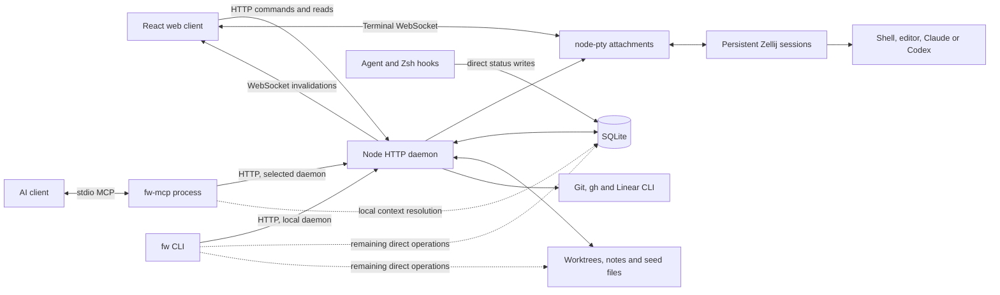

# FritzWorks: standalone repository and npm distribution

Assessment of the working tree on September 17, 2026, including the existing
uncommitted PTY change. This is an analysis, not a repository extraction or a
publication. The main source is [packages/fritzworks](packages/fritzworks/).

**Recommendation.** Extract FritzWorks into one repository and initially publish
one npm package containing the daemon, CLI, stdio MCP adapter, compiled web
client, hooks, and optional desktop integration. Its runtime is already mostly
contained within the package directory. The larger task is removing personal
assumptions and making installation, configuration, and upgrades dependable.

It is already structurally an npm package: `@fritzy/fritzworks@1.0.0`, with three
executables, a runtime file allowlist, a license, and build/release scripts. A
fresh tarball install exposed a native-dependency installation problem, so the
existing README's single install command is not yet sufficient in every tested
environment. This assessment does not establish whether the package is currently
published or whether its npm scope is available to a particular publisher.

**Current architecture.**

The HTTP daemon and MCP server are separate processes. `fw-mcp` is a stdio
client of the HTTP daemon; the daemon does not currently expose an HTTP MCP
endpoint. AI clients start the stdio process. Local service requests start the
HTTP daemon on demand; requests for a configured remote daemon do not start it.

| Component | Current responsibility | Extraction implications |
| --- | --- | --- |
| `server.js`, `lib/daemon.js` | HTTP startup, PID metadata, health checks, logging, source-revision detection and detached-process lifecycle | Already package-relative; needs stronger configuration and upgrade handling |
| `lib/api.js` | HTTP routes, WebSocket events, terminal ownership, watchers, operations and static assets | Main orchestration boundary; about 2,480 lines and several responsibilities |
| `lib/core.js`, `lib/panels.js`, migrations | SQLite state, worktrees, lifecycle, resources, layouts and event journal | Mostly reusable; direct consumers prevent the daemon from being the sole state owner |
| `mcp.js` | Tool schemas and HTTP delegation, including named remote daemons | Already suitable for the `fw-mcp` executable; local context resolution still opens SQLite |
| `cli.js` | Interactive selection, creation, lifecycle, hooks, daemon control and reporting | Still local-only; several operations bypass HTTP |
| `web-v2/`, `web/v2/` | React/Vite/Tailwind source and built assets, with xterm terminals | Can ship in the same npm tarball; users need no separate frontend build |
| `lib/hooks.js`, `shell/fritzworks.zsh` | Install client hooks and report working/ready state | Install/status exist; configurable targets and uninstall are missing |
| `app.js`, `desktop/` | Dedicated Firefox window, profile modifications and Linux launcher files | Optional integration with personal-environment assumptions |

**Daemon and HTTP API.**

The daemon owns substantial shared state already: workstreams, associated links,
ordered panel groups, open resources, persistent terminal identities, and active
workspace state. The API covers lifecycle operations, panel/resource changes,
notes and Markdown editing, PR previews, terminal resets, configuration, daemon
discovery and browser refresh. It serves the built application at `/v2/`.

Browser events are primarily invalidations: a mutation changes SQLite, the
daemon broadcasts an event, and the browser reloads the relevant authoritative
model. A durable database event journal also catches changes from other
processes, including hooks. Markdown watchers follow focused files, and saves
use content hashes to detect conflicting edits. Panel mutations use optimistic
revision checks. These are useful foundations to preserve.

Terminals are not just child shells of the browser. Zellij retains the underlying
session while node-pty provides an attachment to a WebSocket client. Ownership,
suspension and reconnection prevent multiple browser views from simultaneously
controlling the same attachment. This distinction should remain explicit in
documentation and tests, especially across daemon upgrades.

The remaining daemon work is concrete:

- **Finish state ownership.** The CLI still directly resolves local targets,
  modifies stack relationships, executes stack/rebase operations, and reads or
  writes notes/digests. MCP still opens the local database for context. Hooks
  also open and initialize the database for status updates. Introduce daemon
  operations for these cases, or explicitly retain and document a narrow offline
  hook mechanism rather than claiming all state goes through HTTP.
- **Separate configuration from module initialization.** `CONFIG` is resolved
  once at import time. Core database/path defaults and even the static asset CSP
  derive from that singleton. Passing a different `config` to the service does
  not consistently redirect all helpers. Prefer one explicit application context
  containing configuration, database, providers and process runners.
- **Make configuration changes observable.** Daemon freshness hashes package
  sources, not the resolved user configuration. Editing a config file does not
  automatically replace the running daemon. Offer an explicit reload/restart
  contract and display the effective config revision.
- **Define supervised operation.** Detached auto-start is already implemented;
  systemd is not required for normal use. For optional systemd/launchd support,
  make foreground mode discoverable by the CLI and prevent auto-start from
  competing with a supervised instance. Foreground startup currently does not
  write the daemon PID metadata unless `FRITZWORKS_DAEMON=1` is supplied.
- **Harden long-running operation.** Add request cancellation/timeouts to the
  daemon client, log rotation and useful diagnostics. Several Git/Zellij paths
  still use synchronous child processes, which can stall HTTP and terminal
  processing. Move expensive operations behind asynchronous jobs where needed.

**MCP and CLI parity.**

The MCP adapter has a better remote boundary than the CLI: it advertises named
daemons, accepts a daemon selector, and performs remote Git/filesystem work
through that daemon's API. It appropriately requires explicit workstream
selection for remote operations rather than interpreting the local working
directory as remote context.

The CLI imports `requestLocalService`; it has no equivalent general daemon
selector. Both `fw list` and MCP `fw_list` request one page of 100 workstreams,
whereas the web client iterates pages. A generic release should avoid silently
truncating the command/tool view of larger inventories.

Create a maintained action matrix for web, CLI and MCP. It should cover lifecycle,
resources, panel/group management, provider selection, resets, stack operations,
notes and browser focus. Some view-local actions can intentionally remain web
only. Shared operations should have consistent target resolution and errors.
An API version/capability response would let clients handle older remote daemons
without requiring every machine to update simultaneously.

**Web client.**

The frontend is already a distributable local application. Vite builds source
from `web-v2/` into `web/v2/`; React, xterm and Markdown rendering dependencies
are build dependencies rather than packages users must install separately.
The daemon serves the resulting assets. A separate web package or hosted service
is not needed for extraction.

State is deliberately split: layout/resources live in SQLite, while theme,
terminal font, sidebar width and branch-prefix presentation live in browser
storage. This is reasonable, but config documentation should distinguish daemon
settings from browser preferences. A future settings UI can provide editable
daemon configuration with validation and an explicit restart notice.

Specific frontend gaps:

- The default hidden branch prefix is `fritzy/`; the Linear input says “current
  ECO cycle.” Replace personal defaults and derive integration labels from the
  daemon's configured capabilities.
- Missing `linear`/`gh` authentication should disable or explain the affected
  controls without making basic session creation look broken.
- The Vite development proxy covers `/fw`, `/notes`, `/markdown` and `/icons`,
  but omits routes now used by the app, including `/daemons`, `/panel-layout` and
  `/browser`. Update it or use one development proxy rule with a clear asset
  boundary.
- Paths assume deployment at the origin root plus `/v2/`. WebSocket URL creation
  discards a configured daemon URL's pathname. Either document root-only
  deployment or support a configurable API/application base path consistently.
- Ordinary browser use is supported by `fw web start`; make that the default
  onboarding path. The dedicated Firefox launcher should be optional.

**Configuration: what works and what is missing.**

The current resolver already provides bundled INI defaults, an XDG user file,
environment overrides, legacy-path fallback, home expansion, command arrays,
provider-specific models and named remote daemons. It validates several useful
types and prints resolved settings with `fw config`. This needs extension, not
replacement with a new configuration framework.

| Area | Current limitation | Change needed for another user |
| --- | --- | --- |
| Built-in locations | Defaults name `fritzy/notes` and `fritzy/dotfiles` | Ship no personal repositories; offer an optional example configuration |
| Remote machines | Every installation inherits `workstation` at `http://127.1.1.2:7337` | Default to local only; make remote endpoints explicitly opt-in |
| Removing defaults | Deep merge has no documented per-location/per-daemon disable or deletion convention | Add `enabled=false` or explicit replacement/removal semantics; validate it |
| Notes | `paths.notes` is derived while resolving configured locations; notes layout assumes work/journal, Monday weeks and English headings | Make notes storage independent of a Git-backed location; allow basic notes without a notes repository; later add templates/locale/week settings |
| Work suggestions | `lib/suggestions.js` fixes an ECO team, Chainguard repositories, a label and three teammate accounts | Configure named work sources, filters, ranking and limits; disabled sources make no requests |
| Git hosting | Clone URLs, PR parsing and links assume github.com | Clearly support GitHub first; add host/clone URL configuration before claiming enterprise or generic Git support |
| External commands | Only shell/editor/Claude/Codex commands are configurable; Git, gh, Linear, Zellij and some openers are literal executables | Extend the command map and expose capability checks |
| Agent support | Provider names and invocation/resume behavior are fixed to Claude/Codex, including database constraints | Support those two well initially; use adapters if adding more providers later |
| Shells | Shell executable can be fish/Bash/etc., but installed status hooks are Zsh only | Match hook installation to selected shell or explicitly disable unsupported status tracking |
| Client directories | Hooks target `~/.claude/settings.json` and `~/.codex/hooks.json` | Resolve supported client-home overrides and allow explicit target paths |
| Desktop | Firefox `appmode` must already exist; profile discovery is Linux-oriented; API path opening always uses `xdg-open` | Default-browser launch plus platform-aware file opening; optional profile creation and desktop install |
| Presentation | Some preferences exist only in localStorage, including personal branch-prefix defaults | Neutral defaults and documented ownership/import/export of preferences |
| Validation and reload | Unknown keys can be ignored; configuration is an import-time snapshot | Schema/version, unknown-key diagnostics, `config validate`, effective-source reporting and explicit reload behavior |

“Fully configurable” should have a defined product boundary. A useful first
release can support a single developer on Linux/macOS, GitHub repositories,
Zellij, and Claude/Codex. Windows, arbitrary Git forges, interchangeable terminal
backends and third-party agent plugins are separate expansions. They need not
block a good standalone package within the declared boundary.

**Hooks and agent integration.**

`fw hooks install` already merges agent hooks and installs a copied Zsh script.
It recognizes legacy `ws` hooks, writes settings atomically, avoids duplicate
handlers, and preserves a symlinked `.zshrc` by updating its resolved file.
`fw hooks status` reports installation. Events map to working/ready state;
`FRITZWORKS_ID` or working-directory context associates them with a session.

For distribution, add provider/shell selection, explicit config paths,
installation previews/backups, and uninstall that removes only FritzWorks-owned
entries. Respect client-specific hook trust/enablement rather than equating
“file contains a hook” with “client executes the hook.” Hook commands also need
to resolve when an AI client or desktop app has a different PATH from the user's
interactive shell. Diagnostics should test actual delivery.

Status hooks currently write SQLite directly with a five-second busy timeout.
That is a deliberate cross-process design, not an HTTP hook API. Keep this
choice explicit: either make it a small supported offline writer with a defined
schema/migration contract, or send events to the daemon with short timeouts and
a bounded fallback. Do not silently make shell prompts depend on a slow network
request.

The `fw` and `fritzworks` skills currently live outside the npm package in the
dotfiles' Claude/Codex skill directories. Include one canonical source in the
new repository and an explicit installer for supported clients. MCP registration
also needs a package-owned setup command or documented executable-based
registration. Prefer `fw-mcp` over a path into the dotfiles checkout.

**Network and trust boundary.**

The current daemon has no authentication. Loopback default binding is appropriate
for its present single-user model. Remote browser terminals require a loopback
peer, which matches SSH forwarding to local aliases rather than arbitrary direct
network deployment. Configuring an HTTPS daemon URL alone does not establish
authenticated remote access.

There is useful protection already: WebSocket origin checks, payload limits,
confined notes paths, content version checks, and an opaque-origin sandbox for
local HTML resources. However, REST handling reflects allowed loopback origins
in CORS headers without rejecting other origins, and JSON bodies are parsed
without requiring a JSON content type. Treat request-side Host/Origin checks and
cross-site mutation protection as a release hardening item; CORS response headers
alone are not that protection. This is a code-review finding, not a demonstrated
browser exploit from this audit.

Keep the initial remote story explicit: authenticated SSH tunnels and loopback
services. Direct remote access would require an authentication design covering
HTTP and WebSocket handshakes, configurable allowed origins, proxy behavior,
credential storage and TLS guidance. This is additional product scope, not a
prerequisite for moving the repository.

**What moves to the new repository.**

Move the entire package directory first, preserving its existing entry points and
source layout. Include source, tests, default configuration, migration files,
font licenses, desktop assets and documentation. Bring in the shared FritzWorks
skills and the FritzWorks-specific setup responsibilities from `bootstrap.sh`:
hook installation, MCP registration, launcher/icon installation and legacy alias
migration. The new repository should own those operations; dotfiles should
become one consumer of them.

Preserve history using a separate clone and a history-filtering extraction if
history matters. Account for the previous `packages/ai-workstream` path as well
as `packages/fritzworks`; filtering only the newest path can discard pre-rename
history. Include the existing uncommitted PTY change deliberately when selecting
the extraction snapshot. Do not rewrite this dotfiles repository in place.

Then update package repository/homepage/bugs metadata, add CI and release
documentation, and change bootstrap from checkout-file symlinks to a pinned
package installation or an explicit development checkout. Keep your own repos,
workstation endpoint and work-source filters in your personal config. No user
database, notes or Zellij session migration should be required merely because
the source repository moves.

One package is the lowest-friction starting point. Splitting daemon, MCP, CLI and
frontend into separately versioned packages now would add compatibility and
release work without solving the present configuration gaps. Internal modules
can still separate service operations, storage, integrations and transport code.

**Npm feasibility and installation contract.**

The existing `bin` and `files` fields are the right mechanism for shipping the
three commands and a compiled frontend. The production tarball need not include
React build tooling. Build and test on the publisher's machine/CI, then ship
ready-to-serve assets. `prepack` and `prepublishOnly` already run the full check;
they are publisher lifecycle steps, not a reason to run frontend builds in an
end user's install. See [npm package metadata](https://docs.npmjs.com/cli/v11/configuring-npm/package-json/)
and [npm lifecycle scripts](https://docs.npmjs.com/cli/v11/using-npm/scripts/).

`node-pty` is the main install constraint. Native installation may need platform
build prerequisites, and dependency install-script policy differs by npm
version. On npm 12, a global installation needs explicit script approval, for
example a documented `--allow-scripts=node-pty` install option. A consuming local
project uses its own `allowScripts` policy. The package's own approval is not a
universal permission for consumers. See [npm install-script approvals](https://docs.npmjs.com/cli/v12/commands/npm-install-scripts/)
and [node-pty requirements](https://github.com/microsoft/node-pty#dependencies).

Add an `fw doctor` command that checks native PTY loading, Node version, Git,
Zellij features/version, selected shell/editor/agent, optional integrations,
paths and permissions, daemon health and hook delivery. Errors should name the
failed prerequisite rather than surface a module-loader stack trace.

Keep installation noninteractive and free of automatic user-config edits.
Offer explicit setup, hooks, MCP, desktop and optional service-install commands.
These are proposed commands; most do not exist today. A general setup command
should be idempotent and able to undo only what it installed.

**Verification performed.**

| Check | Observed result |
| --- | --- |
| Existing test suite, outside sandbox restrictions | 132 tests passed; zero failed |
| Package dry run, lifecycle scripts disabled | 62 files; approximately 2.35 MB compressed / 5.68 MB unpacked |
| Independent source copy and full release check | Frontend build and syntax checks passed; 131 tests passed and one failed because the checkout directory was named `source` |
| Cause of isolated test failure | `test/cli.test.js:21` assumes the default config path ends in `/fritzworks/config.ini`; line 22 also assumes a particular user-config suffix |
| Fresh tarball install with production dependencies, Node 26.5.0 / npm 12.0.1 on this Linux host | Installation returned success; `fw`, `fw-mcp`, `fritzworks` bins existed and `fw --version` returned 1.0.0 |
| Initial packed HTTP daemon startup | Failed to load `node-pty` because npm blocked its dependency install scripts |
| After `npm install-scripts approve node-pty` and `npm rebuild node-pty` in the temporary consuming project | Packed daemon started; `/health`, `/v2/`, `/panel-layout`, `/daemons` and a bundled font all returned HTTP 200 |
| Tarball contents | Compiled UI and font licenses included; four source maps included; agent skills and the README's `fritzworks.png` image omitted |

The packaged installation was tested in a temporary prefix with isolated config
and data, not as a global install. The independent build reused the checkout's
development dependencies; production installation resolved fresh dependencies.
No npm publication, production daemon restart or source extraction was performed.
The TODO's “88 pass, 1 fail” baseline is stale. This audit does not establish
real-agent hook behavior, macOS compatibility or real Zellij terminal survival
across upgrades; those need dedicated acceptance tests.

**Recommended order and release criteria.**

1. **Extract without changing behavior.** Move the package and skills, update
   metadata, preserve prior-path history, add CI, and make tests independent of
   checkout name and ambient user config. Keep your personal configuration in
   dotfiles. A mechanical extraction is roughly one to three engineering days.
2. **Make a fresh local installation usable.** Remove personal defaults,
   configure/disable work sources, decouple notes from configured Git locations,
   solve/document native installation, and add doctor/setup/uninstall plus
   portable browser opening. Budget roughly one to two additional weeks for
   implementation, packaging tests and onboarding cleanup.
3. **Complete the client/service contract.** Add CLI daemon selection, finish
   state ownership, cover action parity and pagination, define config reload and
   API compatibility, and harden request validation and diagnostics. Test real
   terminal restart/reconnect and actual supported-client hooks. Allow another
   two to four weeks for a dependable Linux/macOS release, depending on the
   remaining platform failures. These are planning estimates, not measured work.
4. **Expand only after that baseline.** Consider authenticated direct remote
   deployment, enterprise Git hosts, additional providers or terminal backends.
   Windows support is outside these estimates; the package currently explicitly
   supports only Linux and macOS.

The first public-release acceptance test should install the tarball into a clean
environment with no dotfiles checkout, personal repositories, Firefox profile,
Linear account or preconfigured remote daemon. It should start the service and
UI, create a scratchpad and Git worktree, execute CLI and MCP operations, show
hook state, preserve a real terminal across daemon restart, and keep data intact
through upgrade. A second configuration should exercise a remote daemon through
the supported tunnel topology. Run this matrix on the declared Node/platform
versions and include npm script-approval behavior in the documented install path.
